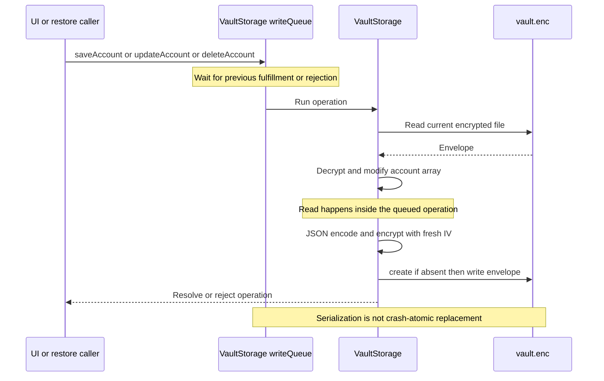
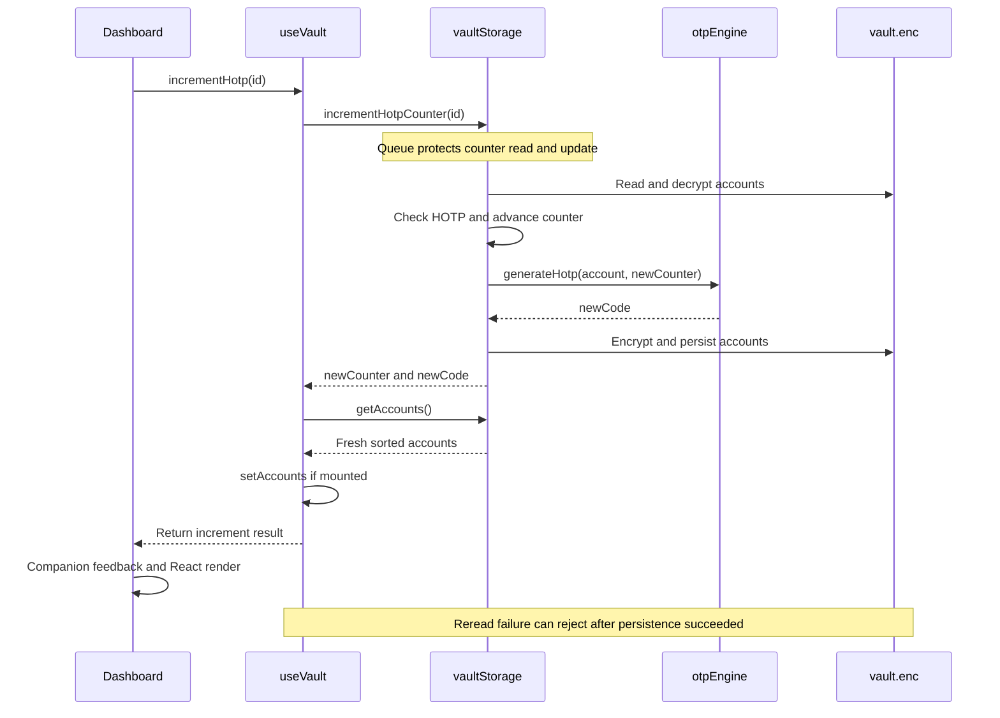

# Encrypted Vault and Account Data Lifecycle

The vault separates **key custody** from **account capacity**: SecureStore holds a small Master Vault Key (MVK), while `Paths.document/vault.enc` holds the encrypted account database. `VaultStorage` owns persistence and exports the shared `vaultStorage` instance. `useVault` owns the dashboard's in-memory account list, loading flags, search, and OTP clock; it rereads storage after mutations rather than optimistically editing the list.

This is local encrypted storage, not a transactional database. Its Promise queue protects read-modify-write operations made through one instance, but does not make filesystem replacement crash-atomic or make a restore of many accounts all-or-nothing.

## Key custody and encryption boundary

`initializeVault()` reads `simpleotp_vault_key` from `expo-secure-store`. If absent, it generates 32 random bytes, Base64-encodes them, and stores them with `keychainAccessible: SecureStore.WHEN_UNLOCKED`. An existing value must decode to exactly 32 bytes or initialization rejects. Only the key, not the account array, occupies SecureStore: the storage stress test keeps this value at 44 Base64 characters while saving 50 accounts.

The decoded key lives in `cachedMvk: Uint8Array | null`. Subsequent initialization calls return immediately once it is cached. Successful `resetVault()` clears it; the storage service does not clear the cache on backgrounding or UI lock, nor explicitly overwrite its bytes when clearing the reference. Key creation and IV creation use `getRandomValues`, which prefers `globalThis.crypto.getRandomValues` and falls back to `expo-crypto`.

**Do not equate the biometric UI lock with authentication-bound MVK access.** The biometric service has a separate setting, `simpleotp_biometric_lock_enabled`, and uses `expo-local-authentication`. MVK storage sets `WHEN_UNLOCKED`, but does not set `requireAuthentication` or invoke biometric authentication when reading the key. See [Security Boundaries](security-boundaries.md) for the broader UI protection model.

Initialization itself is not queued or protected by a shared in-flight Promise. Concurrent cold reads or initializations can both observe an absent key and generate different keys. The mutation queue avoids that scenario for writes confined to one instance, but is not a general initialization lock. Any extension that adds independent readers or storage instances must preserve a single key-creation authority.

## File format, reads, and ordering

Every persistence operation serializes the **whole** `OtpAccount[]` with `JSON.stringify`, encodes it as UTF-8, and encrypts it with AES-256-GCM using the cached MVK and a fresh 12-byte IV. The 16-byte authentication tag is split from the ciphertext. The outer JSON has this shape:

```ts
interface EncryptedVaultContainer {
  version: 1;
  iv: string; // Base64 (12 bytes)
  tag: string; // Base64 (16 bytes)
  ciphertext: string; // Base64
}
```

This local format reuses Base64 utilities and IV/tag constants from `backupCipher`, not the backup passphrase KDF. A `.simpleotp` backup uses password-derived encryption and a different container; copying `vault.enc` alone is not a portable backup. See [Backup and Transfer](../workflows/backup-and-transfer.md).

`getAccounts()` initializes the key if needed, reads the file, decodes the envelope, joins ciphertext and tag, and decrypts. Its returned list is sorted by `createdAt` descending, with missing timestamps treated as zero. Ordering is reconstructed on reads, not a user-managed ordering stored separately.

The reader's checks are narrower than a full schema validator: it checks that IV, tag, and ciphertext are present, but does not explicitly validate `version`, field types, or IV/tag lengths. Decrypted JSON is cast to `OtpAccount[]` and sorted without validating each account. TypeScript contracts are not runtime validation; changes to ingestion or restore must continue to validate data before persistence. See [OTP Contracts](../concepts/otp-contracts.md) and [Account Ingestion](../workflows/account-ingestion.md).

## Mutation serialization

`saveAccount`, `updateAccount`, `deleteAccount`, `incrementHotpCounter`, and `resetVault` enter `enqueueWrite`. The queue uses `this.writeQueue.then(op, op)`: a pending operation waits for its predecessor, and a rejected predecessor still allows the next operation to run. The failed caller still receives its rejection. This is **queue recovery**, not a retry or rollback of the failed operation.


*Each queued mutation rereads current disk state before encrypting the replacement database.*

The storage-level rules are deliberately limited:

- **Save:** requires truthy `id`, `account`, and `secret`, and type `totp` or `hotp`; rejects a duplicate ID. It does not enforce semantic issuer/account/secret deduplication or full OTP field validation.
- **Update:** finds the ID and replaces the entire account object, rather than merging selected fields. Missing IDs reject; save's field checks are not repeated.
- **Delete:** filters by ID and rejects if nothing was removed.
- **HOTP increment:** finds an HOTP account, advances `(counter ?? 0) + 1`, generates the new code, persists the array, then returns `{ newCounter, newCode }`. Unknown IDs and TOTP accounts reject.

### What the queue does not guarantee

The mutex is instance-local. `getAccounts()` and `initializeVault()` do not join it, and a second `VaultStorage` instance has a separate queue. It is not a cross-process lock or a read barrier. `persistAccounts()` directly calls `file.create()` when needed and `file.write()` on the target file; there is no temporary-file rename, journal, or rollback in this implementation. Do not interpret the source comment's “atomic write serialization” as a power-loss durability guarantee.

Serialization also cannot resolve **stale full-object updates**. `renameAccount` spreads the account from hook state, and `EditAccountModal` spreads its selected account before replacing edited fields. If an HOTP increment persists first and a stale edit later replaces the same object, the later update can restore an old counter. Queueing stops overlapping read-modify-write operations from losing unrelated accounts, but does not provide revision checks or field-level conflict resolution.

## From HOTP persistence to UI refresh

The dashboard calls `useVault.incrementHotp(id)`. The hook awaits the storage result, rereads accounts, updates React state while mounted, and only then returns the result to the dashboard handler. The handler uses `newCounter` for companion feedback.


*The HOTP result is returned by the hook after its post-write refresh, not before persistence.*

Save, update, delete, and rename follow the same persist-then-reread pattern. Mutation errors propagate to callers. The edit modal awaits `onSave`, closes after success, and logs a warning and displays an alert on failure. A post-write reread failure is therefore not proof that the write failed; blindly retrying a counter increment can advance it twice.

On mount and pull-to-refresh, `loadAccounts()` initializes and reads the vault. Unlike mutation callbacks, it catches errors and logs `Failed to load accounts from vault:`; it clears loading/refreshing flags without exposing an error field. Failed initial loads leave the default empty list, while failed later refreshes retain the previous list. An empty dashboard is therefore not sufficient evidence that the encrypted database is empty.

Search is a trimmed, case-insensitive literal substring match against issuer or account in hook memory. Storage also offers a disk-backed `searchAccounts`. The hook's one-second heartbeat updates `now`; foreground activation resynchronizes the clock, not the account database. Unmount guards prevent asynchronous account loads and mutation rereads from setting account state afterward.

## Failure and reset semantics

| Condition | Storage behavior | Operational consequence |
| --- | --- | --- |
| Missing file or blank/whitespace file | Returns `[]` after key initialization | A later save writes a new database; blank files are not reported as corruption. |
| Existing MVK decodes to a non-32-byte value | Rejects with `Corrupted Master Vault Key: invalid key length in SecureStore` | Does not silently replace an invalid-length key. |
| Malformed outer JSON | Rejects with `Corrupted vault file: malformed JSON` | Normal mutations cannot read through it to repair the file. |
| Missing envelope parameters | Rejects with `Corrupted vault file: missing cryptographic envelope parameters` | Presence checks do not amount to complete schema validation. |
| Wrong valid-length MVK, tampering, or failure during decrypt/parse/sort | Rejects with `Vault decryption failure: unable to decrypt account database with MVK` | The message does not distinguish wrong key from damaged content. |
| Missing SecureStore key but existing encrypted file | Generates a new key, then cannot decrypt old ciphertext | Key regeneration does not recover the old accounts. |

`resetVault()` queues file deletion, then awaits SecureStore key deletion, then sets `cachedMvk = null`. The next access generates a new key and sees an empty database. This sequence is destructive and not transactional: a SecureStore deletion failure can occur after the file has already been removed, before cache clearing.

Settings restore first decrypts the backup, then applies accounts separately. **Replace** resets the vault before saving each account. **Merge** snapshots existing IDs and individually updates or saves accounts. Neither is a multi-account transaction: an error can leave an empty or partially restored replacement, or a partially applied merge. Other queued mutations can interleave between these separate calls. The UI's `onAccountsRestored` refresh callback runs only after the whole loop succeeds, while failure displays a storage error alert.

## Focused validation and safe changes

The relevant tests exercise different boundaries:

- [Storage unit tests](../../__tests__/unit/storage.test.ts) cover key generation/reuse, missing files, CRUD, newest-first ordering, encrypted on-disk content, HOTP persistence, tampering, and a 50-account capacity check.
- [Tier 5 hardening tests](../../__tests__/adversarial/tier5_crypto_storage_hardening.test.ts) cover invalid MVK lengths, cold persistence, malformed/missing envelopes, blank files, HOTP guards, reset, and 50 interleaved mutations on one initialized instance. Sequential success after rejected HOTP calls also exercises queue recovery.
- [Hook unit tests](../../__tests__/unit/useVault.test.tsx) mock storage to test mount loading, literal search, CRUD forwarding, HOTP refresh, clock resynchronization, and listener cleanup.

These tests use in-memory native-module mocks; they do not establish crash-safe filesystem writes, authentication-bound key retrieval, or multi-instance locking. Before extending this layer, test cold initialization races, stale edit versus HOTP increment, write-success/read-failure handling, and partial restore failures explicitly. See [Validation](../testing/validation.md) for the wider testing context.
