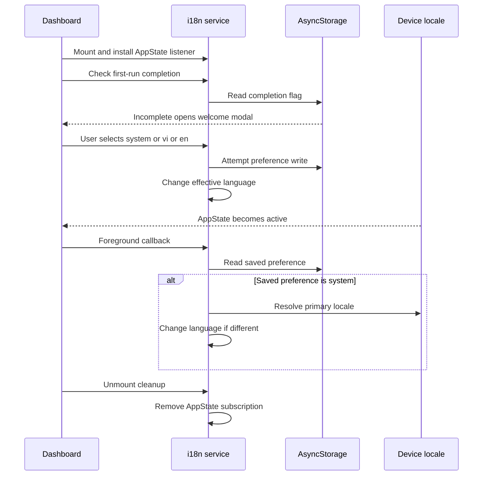
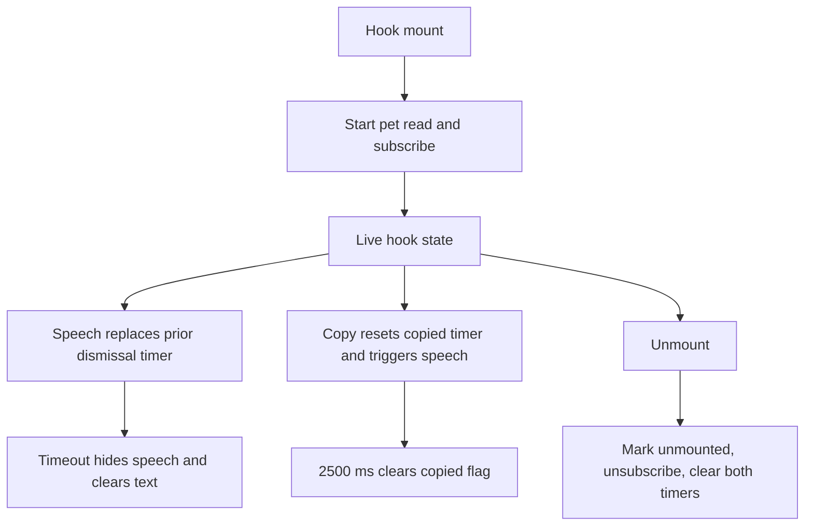

# Localized Experience and Pet Companion

The companion is a presentation layer around vault activity, not an OTP engine or a security boundary. The dashboard composes `useVault` with `usePetCompanion`: it supplies the **full account count** and TOTP urgency, connects card-copy callbacks to celebration, and owns the rendered speech bubble and Academy modal. Search results do not determine whether the mascot considers the vault empty. See [Application Runtime](runtime.md) and [OTP Contracts](../concepts/otp-contracts.md) for the underlying lifecycle and token behavior.

## Ownership and preferences

Pet and language preferences are independent of vault account data. They use AsyncStorage keys rather than being fields on an OTP account:

| Preference | Storage key | Initial or invalid-value behavior |
| --- | --- | --- |
| Selected pet | `@simple_otp_selected_pet` | `cipher-cat` |
| Language preference | `@simple_otp:language` | Missing, invalid, or unreadable values return `null` |
| First-run language completion | `@simple_otp:language_initialized` | Only the string `true` counts as complete |

`petStorage` owns validation, a process-local cache, and change listeners. Its accepted pets are `cipher-cat`, `byte-dog`, and `shield-bunny`. Invalid writes throw; missing, corrupted, or failed reads use the default. Writes update the cache first, attempt disk persistence, then broadcast even when the disk write fails. Each listener is isolated from exceptions in another listener. Consequently a selection can work for the current session without surviving a restart.

Settings loads preferences when visible and subscribes to pet changes until that effect is cleaned up. The companion hook also subscribes, so Settings and the dashboard synchronize through `petStorage`, not through vault refreshes. The hook's `setPet` updates local state before awaiting persistence.

Pet hydration is asynchronous: the hook starts with the default pet and `isLoading = true`, subscribes immediately, and clears loading after the read completes. Its hydration guard replaces the current pet only if it is still `DEFAULT_PET_ID`. This protects a newer **non-default** selection from a late read, but is not a general request-version or last-write-wins guard. On unmount, a mounted flag suppresses the hydration update and the subscription is removed.

Sources: [pet storage](../../src/services/pet/petStorage.ts), [companion hook](../../src/hooks/usePetCompanion.ts), [Settings integration](../../src/components/settings/SettingsModal.tsx).

## Language startup and foreground behavior

The stored preference is `system`, `vi`, or `en`; the effective i18next language is `vi` or `en`. `resolveSystemLanguage` examines only the primary device locale, lowercases its language code, and recognizes Vietnamese and English prefixes. Unsupported, empty, or failing locale reads resolve to Vietnamese. `DEFAULT_LANGUAGE` and i18next's `FALLBACK_LANGUAGE` are both `vi`.

Startup is deliberately two-phase. i18next initializes synchronously with the device language, then asynchronously reads the saved preference outside tests and switches if necessary. An explicit saved language can therefore replace the language used on an initial render; startup does not wait for preference hydration.

The dashboard checks the separate completion flag on mount outside tests. If incomplete, it shows `LanguageWelcomeModal`. The modal defaults to `system`, loads any saved preference when visible, and applies each selection immediately through `setAppLanguage`. Confirmation reapplies the selection, stores completion, and invokes `onComplete`. Hardware-back dismissal is blocked. Selecting a language alone does not mark first-run setup complete.

`setAppLanguage` attempts to store the preference before changing the active language. Storage write errors are swallowed, so the current UI can change even if persistence fails. A failed completion write can cause the welcome flow to appear again on a later launch.


*The foreground listener re-resolves device locale only for a saved `system` preference; explicit languages stay fixed.*

The dashboard installs `setupLocaleAppStateListener` and removes it on unmount. On every `active` notification it rereads the saved preference; a missing preference is **not** treated as `system` by this listener. In `NODE_ENV === 'test'`, initial language comes from `TEST_LOCALE` or `DEFAULT_LANGUAGE`, saved-preference startup hydration is skipped, and the dashboard skips the welcome check. `TEST_LOCALE` controls initial test setup, not an immutable language lock: tests can still call `changeLanguage`.

Sources: [locale engine](../../src/services/i18n/index.ts), [configuration](../../src/services/i18n/config.ts), [welcome modal](../../src/components/common/LanguageWelcomeModal.tsx), [dashboard lifecycle](../../src/app/index.tsx).

## Mascot precedence and event feedback

Mascot state is recomputed from inputs; it is not a stored state-machine history. The resolver imposes strict precedence:

<!-- openwiki: mermaid parse failed and this diagram was converted to a text fence so it does not break rendering. Fix the diagram source and restore the mermaid fence. Parser error: Heuristic: an unescaped angle bracket inside a label breaks rendering; rephrase the label. -->
```text
flowchart TD
    Inputs["Account count, copied flag, TOTP urgency"] --> EmptyCheck{"accountCount <= 0?"}
    EmptyCheck -->|Yes| EmptyState["1. EMPTY"]
    EmptyCheck -->|No| CopyCheck{"Copied flag active?"}
    CopyCheck -->|Yes| CopyState["2. COPIED"]
    CopyCheck -->|No| WarningCheck{"Urgent TOTP exists?"}
    WarningCheck -->|Yes| WarningState["3. WARNING"]
    WarningCheck -->|No| IdleState["4. IDLE"]
    CopyEvent["triggerCopied resets 2500 ms timer"] --> Inputs
    Expiry["Timer clears copied flag"] --> Inputs
```
*EMPTY masks all other inputs; COPIED temporarily masks WARNING, and expiration recomputes from current vault inputs rather than restoring a remembered state.*

`useVault` recomputes urgency over all accounts, not the filtered search list. It checks explicit TOTP accounts through `getTotpProgress`, ignores per-account failures, and updates from its one-second clock and foreground clock resync. The OTP progress threshold is at most five seconds remaining. The pure helpers in `mascotState.ts` also support urgency calculations, but the dashboard receives `useVault.hasUrgentTotp` rather than calling `evaluateTotpUrgency` itself.

A card-copy callback triggers `triggerCopied`. Successful camera and gallery imports also reuse this celebration, then replace its copy speech with a localized success toast. HOTP increments instead show `dashboard.hotpReadyToast` for 3000 ms after the increment resolves. Thus `COPIED` is a UI celebration signal, not proof that a clipboard operation occurred. State changes alone do not automatically generate speech.

The hook has two independent timeout owners:

- **Copied timer:** each celebration cancels the previous timer, sets the copied flag, and clears it after `COPIED_DURATION_MS = 2500`.
- **Speech timer:** new speech cancels the prior dismissal timer and replaces message/action text. Default dismissal is `SPEECH_AUTO_DISMISS_MS = 4000`; copy speech uses 2500 ms. A non-positive timeout leaves speech visible until replacement or dismissal. `dismissSpeech` clears the timer and message/action state.


*Subscriptions and both transient timers belong to the hook lifetime. There is no companion-specific AppState pause/resume logic.*

Sources: [state resolver](../../src/services/pet/mascotState.ts), [vault clock and urgency](../../src/hooks/useVault.ts), [OTP progress](../../src/services/crypto/otpEngine.ts), [event wiring](../../src/app/index.tsx).

## Dialogue and Academy navigation

Dialogue is separate from i18next's key dictionaries. `getDialoguePool` selects the English catalog for languages beginning with `en`, otherwise the Vietnamese catalog. Unknown pet IDs fall back to `cipher-cat`, and missing categories fall back to `IDLE`. On an IDLE tap, a random choice gives either `TIPS` or `IDLE` with equal probability; EMPTY taps stay in EMPTY.

`getDialogueItem` removes the previous dialogue ID from a multi-item pool, then chooses randomly from the remaining candidates. This avoids immediate repetition when alternatives exist, not repetition across an entire session. The hook keeps one previous-ID ref shared by taps and copy celebrations. Tap speech includes the item's action text or a localized “Open Pet Academy” default. Existing speech is a captured string: switching language does not retranslate an already-visible bubble; subsequent selections use the current language.

The speech action and Settings Academy entry call the hook's `openAcademy`. Its initial lesson is `lesson-1`; passing a lesson ID changes it, while opening without an ID preserves the hook's current target. Closing only changes visibility.

Academy chrome uses translation keys, while `getAcademyLessons` chooses complete English or Vietnamese lesson arrays using the same `en` prefix rule. The modal selects the requested lesson on visibility, target, or catalog changes when that ID exists. Tabs and previous/next navigation clear the local quiz answer; next on the final lesson closes the modal. Lesson data determines the narrator, not the selected pet: the modal accepts `activePetId` but does not use it to choose the narrator. Quiz selection and navigation are local UI state, not persisted learning progress.

Sources: [dialogue selection](../../src/services/pet/petDialogues.ts), [lesson selection](../../src/services/pet/petAcademyData.ts), [Academy modal](../../src/components/pet/PetAcademyModal.tsx), [dashboard wiring](../../src/app/index.tsx).

## Extending the experience safely

Treat a localized feature as three coordinated content surfaces:

1. Update matching keys and interpolation variables in [Vietnamese UI resources](../../src/services/i18n/locales/vi.ts) and [English UI resources](../../src/services/i18n/locales/en.ts), including accessibility text and Academy chrome.
2. Update both [Vietnamese dialogue](../../src/services/pet/petDialogues.ts) and [English dialogue](../../src/services/pet/petDialoguesEn.ts). Keep IDs stable across translations and keep pools non-empty: the selection code returns `pool[0]` for a pool of length at most one, and callers expect an item.
3. Update both [Vietnamese lessons](../../src/services/pet/petAcademyData.ts) and [English lessons](../../src/services/pet/petAcademyDataEn.ts), preserving lesson IDs, ordering, narrator assignments, and quiz correctness. Adding a locale requires more than registering i18next resources: preference types/validation, system resolution, and the two binary catalog selectors must also change.

These are change guidelines, not guarantees of full localization. For example, `PetCompanion` currently has Vietnamese accessibility strings embedded directly in its renderer. Do not interpret mascot dialogue's security assurances as cryptographic contracts; validate those against [OTP Contracts](../concepts/otp-contracts.md).

Theme and assets are extension boundaries, not preference storage concerns. [Theme constants](../../src/constants/theme.ts) provide brand/semantic colors, light/dark palettes, and platform-selected fonts; welcome and Academy consume theme hooks. [Pet rendering](../../src/components/pet/PetCompanion.tsx) uses shared bundled PNG sprite strips and Reanimated state offsets, with animation cleanup on state changes/unmount. New sprite artwork must retain the 16-frame horizontal layout, four frames per state, or update the renderer contract. Check native and web presentation rather than assuming platform font and asset behavior is identical; see [Build and Release](../operations/build-and-release.md).

## Focused validation

The most useful existing unit coverage is:

- [i18n tests](../../__tests__/unit/i18n.test.ts): supported preferences, primary-locale resolution/fallback, corrupted storage, completion flag, translations, and interpolation.
- [companion hook tests](../../__tests__/unit/usePetCompanion.test.tsx): hydration/default, EMPTY and WARNING, COPIED returning to WARNING after 2500 ms, selection, speech timeout, tap CTA, and Academy open/close.
- [Academy data tests](../../__tests__/unit/petAcademyData.test.ts): four sequential lessons, narrator assignments, content structure, and exactly one correct quiz option. These assertions inspect `ACADEMY_LESSONS`, so they do not establish English/Vietnamese parity.

When changing this boundary, add targeted checks for foreground `system` resync versus explicit language, late hydration races, failed persistence, repeated-trigger timer replacement, unmount cleanup, and catalog/key parity. The two primary suites above do not establish all of those lifecycle properties. See [Validation](../testing/validation.md) for the broader testing workflow.
