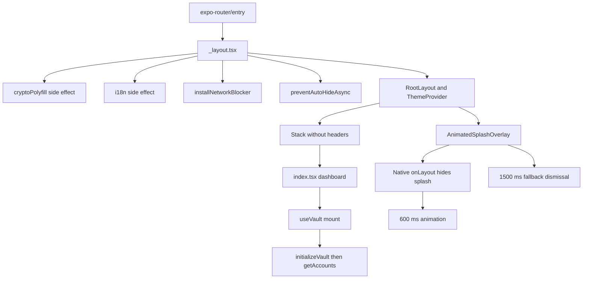
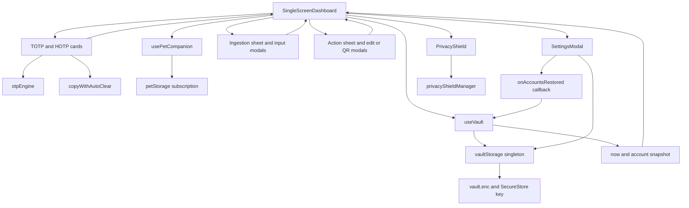

# Runtime architecture and the single-screen dashboard

Simple OTP uses Expo Router for its application shell, but account management, ingestion, settings, QR export, and education are coordinated by **local modal state**, not route transitions. The central boundary is `SingleScreenDashboard`: it composes `useVault`, `usePetCompanion`, cards, and overlays without becoming the persistence or cryptography implementation.

## Startup and readiness

[`package.json`](../../package.json) sets `main` to `expo-router/entry`. [`_layout.tsx`](../../src/app/_layout.tsx) imports the crypto polyfill and i18n initialization as side effects, installs the network blocker at module evaluation, and calls `SplashScreen.preventAutoHideAsync()`. `RootLayout` renders a color-scheme-dependent `ThemeProvider`, `AnimatedSplashOverlay`, and a `Stack` with `headerShown: false`.

*Startup dependencies and independent UI and vault readiness paths. The splash branches describe the native implementation, not the web no-op.*

The native overlay hides the platform splash on layout, then starts a 600 ms animation; completion schedules its dismissal on the React Native thread. A 1500 ms timeout hides both splash and overlay if animation or worklet completion fails. The [web variant](../../src/components/animated-icon.web.tsx) returns `null` for `AnimatedSplashOverlay`. **Splash dismissal is not a vault-ready signal**: neither implementation waits for account loading or authentication.

The network barrier patches the available JavaScript `fetch`, `XMLHttpRequest`, `WebSocket`, `EventSource`, and `sendBeacon` APIs. Outside tests, fetch/XHR permit recognized local-resource prefixes; external attempts are recorded and rejected or thrown, while beacon returns `false`. This is the inspected runtime mechanism, not evidence of an operating-system-wide air gap. See [security boundaries](security-boundaries.md) for the security model.

## State ownership and component relationships

| Owner | Responsibility |
|---|---|
| `RootLayout` | Router shell, theme, splash mounting, startup side effects |
| `useVault` instance | Account snapshot, loading/refresh flags, search query, epoch-seconds clock, derived urgency, persistence callbacks |
| `vaultStorage` singleton | Encrypted account persistence, cached master key, serialized write queue |
| Dashboard | Modal visibility, selected account targets, manual-entry initial values, first-language welcome visibility, callback wiring |
| `usePetCompanion` | Selected pet subscription, transient copy/speech feedback, Academy visibility and lesson selection |
| Modal/card internals | Form and confirmation state, local feedback, OTP presentation |
| `privacyShieldManager` | Shield/lock state subscribed to by the mounted `PrivacyShield` |

*Verified composition and callback relationships. Arrows denote calls, props, subscriptions, or returned state rather than network requests.*

The dashboard gives the companion **the total account count and whole-vault urgency**, not the search-filtered count. Card copy callbacks trigger companion celebration; successful ingestion also triggers celebration and localized speech. HOTP increment feedback is emitted after the hook returns the persisted counter result. The companion hook owns Academy state while the dashboard renders the Academy and speech components. See [localized companion](localized-companion.md).

On mount, the dashboard checks `isLanguageInitialized()` and shows the welcome modal if needed, except in `NODE_ENV === 'test'`. It separately registers `setupLocaleAppStateListener()` and cleans it up on unmount. `PrivacyShield` also independently subscribes to its manager and starts/stops its lifecycle listener. Neither is the vault clock listener.

## Account lifecycle and refresh semantics

`useVault` starts with an empty snapshot and `isLoading: true`. Its mount load awaits `initializeVault()` and `getAccounts()` before replacing accounts. The singleton storage decrypts the local file and returns accounts newest-first by `createdAt`. The hook protects asynchronous state updates with `isMountedRef`.

Account mutations are **persist-then-reload**, not optimistic updates: save, update, delete, rename, and HOTP increment await storage, read the fresh snapshot, and then update mounted hook state. Rename trims labels and silently returns if its target no longer exists. Storage serializes write operations through a promise queue; HOTP increment generates the new code and persists the incremented counter before returning. Cryptographic and storage details belong in [encrypted vault](encrypted-vault.md).

Loading failures are caught and logged by the hook, and loading/refresh flags are cleared in `finally`. There is no returned error state: an initial failure leaves the empty snapshot, and a later failed refresh retains the previous snapshot. Mutation errors, unlike load errors, propagate to callers. In particular, the dashboard action-sheet delete callback invokes `deleteAccount` without awaiting it and immediately clears the target; closing the sheet is not confirmation that persistence succeeded.

### Shared heartbeat and foreground resynchronization

One `useVault` instance supplies `now = Math.floor(Date.now() / 1000)` on a one-second interval. Every rendered `TotpCard` receives that same value as `currentTimestamp` and derives its code and countdown through `otpEngine`. The hook also computes `hasUrgentTotp` from **all accounts**, ignoring HOTP and swallowing individual progress errors.

When `AppState` becomes `active`, the hook immediately resamples wall-clock time. It does **not** reload accounts or increment HOTP on foregrounding. This avoids waiting for the next timer tick after background suspension without inventing a server clock or accumulating ticks. Unmount clears the interval and removes the listener. Cards fall back to `------` and nonurgent countdown defaults on generation/progress failures; invalid placeholder codes cannot be copied.

### Search and explicit refresh

Search is a memoized in-memory filter: trim and lowercase the query, then apply literal `includes` to issuer or account name. It is not a regex, does not inspect secrets, and does not call storage's separate `searchAccounts` method. Blank queries return the full snapshot. The list uses `filteredAccounts`, while the header badge and companion continue to use all accounts. Empty-list UI is suppressed during initial loading and distinguishes a search miss from an empty vault.

Pull-to-refresh sets `isRefreshing` and runs the same load path. Restore is a second, essential explicit refresh boundary: `SettingsModal` writes directly to the storage singleton, bypassing the hook's mutation callbacks. After successful merge/replace application, it calls `onAccountsRestored`, wired to `refreshAccounts` by the dashboard. Merge updates existing IDs and saves new ones; replace resets the vault then saves each restored account sequentially. The sequence is not a batch transaction: a storage failure can occur after partial writes, and the success callback is not invoked on that failure. The callback's returned refresh promise is not awaited by settings.

## Modal coordination and ingestion

The dashboard uses nullable account targets (`actionTarget`, `editTarget`, `renameTarget`, `accountForQr`) and independent booleans for ingestion, camera, manual entry, settings, and welcome. These are not Router destinations or a centralized exclusive-modal state machine.

Cards receive `onOptionsPress={setActionTarget}`, selecting the shared `AccountActionSheet` instead of their fallback platform options menu. The sheet owns delete-confirmation state and resets it when hidden. Edit and QR actions close it and call dashboard callbacks that clear the action target and set the next target. Confirmed deletion calls the supplied delete callback and closes. Edit and rename saves are wired back to the hook; QR export receives the selected account.

The ingestion sheet dispatches camera, gallery, explicit clipboard reading, or manual entry. Camera/gallery/clipboard URI success handlers check duplicates against the current account snapshot, construct an `OtpAccount`, and call `saveAccount`. A clipboard raw secret instead prefills manual entry; the manual modal receives `existingAccounts` and a save callback. Clipboard reading here uses `checkClipboard({ force: true })` in a user-selected action—do not infer automatic clipboard scanning from the feature inventory in `PROJECT.md`. See [account ingestion](../workflows/account-ingestion.md) for parsing and validation details.

## Contracts, extension boundaries, and validation

[`PROJECT.md`](../../PROJECT.md) describes architecture, feature requirements, and historical interface/layout contracts. It is not the execution trace. In particular, these compatibility entrypoints do **not** represent separate implementations:

- `services/crypto/base32.ts` re-exports `services/otp/base32.ts`.
- `services/crypto/backupCipher.ts` re-exports `services/backup/backupCipher.ts`.
- `services/auth/biometricAuth.ts` adapts the legacy `BiometricAuthService` methods to `services/security/biometrics.ts` and re-exports that service module.

When extending a dashboard action, keep persistence behind `vaultStorage` and arrange a hook reload if a component writes outside `useVault`. Preserve the shared clock prop for new TOTP presentations and distinguish foreground clock resync from data refresh. Do not treat modal closing, splash completion, or companion celebration as a storage transaction boundary.

Focused tests document these seams:

- [`RootLayout.test.tsx`](../../__tests__/unit/RootLayout.test.tsx): module-time barrier installation and blocked fetch, splash hold, headerless Stack, overlay, and theme selection.
- [`useVault.test.tsx`](../../__tests__/unit/useVault.test.tsx): initial load, literal/case-insensitive search, mutation delegation, heartbeat, immediate foreground clock update, and listener cleanup.
- [`HomeScreen.test.tsx`](../../__tests__/unit/HomeScreen.test.tsx): dashboard composition, empty/search-empty views, and ingestion/settings opening.

Run a focused check with `npm test -- --runInBand __tests__/unit/RootLayout.test.tsx __tests__/unit/useVault.test.tsx __tests__/unit/HomeScreen.test.tsx`. These mocked unit tests are not device-level proof of splash rendering, biometric behavior, or native network isolation; see [validation](../testing/validation.md). No test-run result is asserted here.
