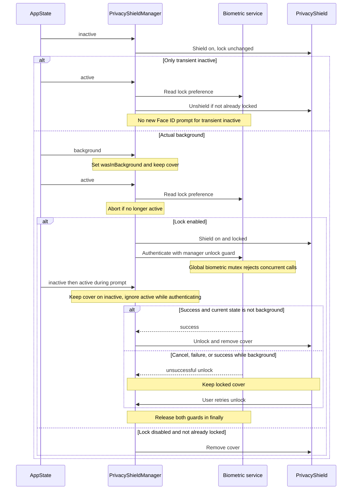

# Security boundaries and application lock lifecycle

Simple OTP has several separate security mechanisms, not one universal lock. The root layout installs a JavaScript network interceptor; the dashboard mounts an AppState-driven privacy cover; a biometric service owns native authentication and a persisted preference; clipboard copies receive a conditional expiry timer. Screen-capture prevention has an implementation but **no application caller enables it in the inspected `src` tree**.

These controls must not be confused with [encrypted-vault storage](encrypted-vault.md). `PrivacyShieldManager.isVaultLocked()` is a UI state: its unlock path changes flags and notifies listeners, rather than unlocking a cryptographic key or erasing decrypted accounts. `useVault` loads accounts on mount independently of biometric authentication. The overlay is therefore concealment and interaction gating, not a storage authorization boundary.

## Offline perimeter: installed early, limited to intercepted JavaScript APIs

[`src/app/_layout.tsx`](../../src/app/_layout.tsx) calls `installNetworkBlocker()` at module evaluation, before rendering the router stack. Installation is idempotent on the singleton. It replaces APIs present at installation time, saves originals for `uninstall()`, and resets its in-memory violation list on a new installation.

| API | Blocked-call behavior |
| --- | --- |
| `fetch` | Returns a rejected promise with `SECURITY_VIOLATION` |
| `XMLHttpRequest` | Throws in nonlocal `open()` and in `send()` unless a local resource was opened |
| `WebSocket`, `EventSource` | Constructor throws |
| `navigator.sendBeacon` | Returns `false` |

Blocked attempts record API, URL, optional method, and `Date.now()` timestamp; `getNetworkViolationLog()` returns a copied array. This is local diagnostics, not transmitted telemetry.

### Local-resource exception and test mode

Outside `NODE_ENV === 'test'`, **only `fetch` and XHR** allow URLs whose trimmed, lowercased strings start with `file:`, `blob:`, `data:`, `assets-library:`, `ph:`, or `/`. They delegate to the saved implementations. This is a string-prefix allowlist, not URL-origin validation: `/` also accepts strings beginning `//`. Bare relative names and `http://localhost` are not explicitly allowed. In test mode the local-resource predicate always returns `false`, so tests exercise a stricter policy than production. WebSocket, EventSource, and sendBeacon have no local exception.

The XHR replacement also makes header, abort, and event-listener methods no-ops, even for the local branch. Do not assume delegation preserves full XHR behavior when adding local-resource consumers.

**Scope:** this interceptor is not an OS firewall or proof that all native traffic is blocked. It covers calls through the replaced globals, not native SDK networking or previously retained references. New native dependencies and resource loaders require their own offline review. Keep the startup integration in the [runtime](runtime.md), but validate the actual device perimeter separately from JavaScript unit tests.

## Privacy cover ownership and placement

[`PrivacyShield`](../../src/components/common/PrivacyShield.tsx) starts the singleton manager's AppState listener, subscribes to `(isShielded, isLocked)`, and removes the subscription and listener on unmount. It returns `null` only when both flags are false. Otherwise it renders an opaque absolute-fill `View` with `pointerEvents="auto"`, `zIndex: 99999`, and `elevation: 99999`. Locked mode adds an unlock button with a loading/disabled state for manual retry.

The actual mount is the **last child of the dashboard's `SafeAreaView`**, after its modal components, not a router-wide overlay in `_layout.tsx`. High z-index orders views within that hierarchy; it does not establish coverage of separate native Modal presentations. For example, `AccountQrModal` presents secret-bearing QR content in React Native `Modal`, and contains no privacy-cover integration. Do not infer native-modal protection from the style comment claiming the cover is above all modals. Sensitive modal previews and touch blocking need device-level verification or a modal-aware integration.

The manager starts with both flags false. Initial biometric preference lookup is asynchronous; only after it resolves enabled does startup mark the UI shielded and locked. Consequently this is not a synchronous pre-render authentication gate.

## Application lifecycle and avoiding the Face ID loop

The manager distinguishes a temporary loss of focus from actual backgrounding. `inactive` synchronously updates the shield flag and notifies listeners, without independently locking. `background` additionally sets `wasInBackground`. On `active`, it ignores transitions during an ongoing biometric prompt or manager unlock, consumes the background marker, reads the preference, and checks that the app is still active after that asynchronous read.

*AppState concealment and biometric retry flow, with separate manager and global authentication guards.*

The two defenses against the Face ID feedback loop are complementary:

- The biometric service sets a global `isAuthenticating` mutex **before availability checks**, rejects concurrent authentication with `already_authenticating`, and resets it in `finally`. The manager's `isUnlocking` prevents duplicate unlock attempts.
- Returning from `inactive` without recorded backgrounding does not request a fresh lock. This prevents the verification prompt used to enable biometrics from immediately causing another prompt on return to `active`.

Startup with the preference enabled sets the locked cover and automatically prompts only when the manager and native AppState indicate active (including the explicit unknown-state fallback). Cancel or failure leaves an already locked cover intact; the button can retry. Success removes the cover unless the **current** state is `background`. That guard intentionally allows success during `inactive`; it is not a requirement that success occur strictly in `active`.

## Biometric policy and failure semantics

[`biometrics.ts`](../../src/services/security/biometrics.ts) wraps `expo-local-authentication`. Availability checks hardware, enrollment, supported types, and enrolled security level. Missing hardware yields `not_available`; no enrollment yields `not_enrolled`. Availability exceptions become an unavailable result. Native prompts request `biometricsSecurityLevel: 'strong'` and `requireConfirmation: true`, with device PIN/passcode fallback enabled by default (`disableDeviceFallback: false`). Native failures retain error/warning information; thrown errors become unsuccessful results rather than escaping.

The lock preference is the SecureStore string `simpleotp_biometric_lock_enabled`; only the exact string `'true'` enables it. **A read error returns false**, so preference lookup is not fail-closed. Enabling checks availability and normally verifies authentication; disabling normally verifies too. Successful writes use `SecureStore.WHEN_UNLOCKED`. The public `verifyWithAuth` argument can bypass verification, but the Settings UI passes `true` for both directions. It reloads the current preference on failure and suppresses an error alert for `user_cancel`. Write failures return an error result.

[`BiometricAuth`](../../src/services/auth/biometricAuth.ts) is a facade over the same checks and authentication function, not a second lock implementation. New authentication consumers should share this mutex-bearing service rather than opening parallel native prompts.

## Screen capture: implemented service, missing activation

`enablePrivacyShield()` requests `preventScreenCaptureAsync('simpleotp_privacy_shield')`, then on iOS conditionally invokes `enableAppSwitcherProtectionAsync(0.8)`. Disable uses the matching key and optional iOS disable function. Both catch and silently ignore errors. `isScreenProtectionActive` changes only after the whole sequence succeeds, so partial native success followed by failure can leave the boolean out of sync with native protection.

The service describes Android `FLAG_SECURE` and iOS app-switcher blur as its intended platform mechanisms. However, neither `PrivacyShield` mounting nor `startListening()` calls enable or disable. Searching application source finds only the methods and their exported wrappers, while adversarial tests call those wrappers directly. **API presence and passing mocked tests do not mean screen-capture protection is enabled in the shipped application.**

Treat this as an integration gap, not as a guaranteed screenshot/recording barrier. A future owner must deliberately pair enable/disable with the intended lifetime, check native platform support, handle partial failures, and verify dashboard and native Modal behavior on real devices. Unsupported environments are currently tolerated silently, without a user-visible protection failure.

## Clipboard: conditional expiry, not guaranteed erasure

TOTP and HOTP cards call `copyWithAutoClear(code)`; the QR export modal calls it with the whitespace-stripped account secret. The singleton owns one tracked token and deadline. A new copy cancels the old timer and starts a fresh **30,000 ms** interval by default; callers can supply another delay. Empty copies return `false` without scheduling.

Expiry clears to `''` only if the clipboard still contains the tracked token, preserving a user's replacement text. If `hasStringAsync` reports no string it skips the wipe. On `active` resume it compares wall-clock elapsed time with the deadline: overdue content is checked immediately, otherwise the timer is rearmed for the remaining duration. There is no immediate wipe simply on backgrounding, and suspended JavaScript is not a guaranteed 30-second execution deadline.

`cancelClipboardClear()` cancels tracking **without wiping**. `clearClipboardImmediately()` cancels tracking and attempts an unconditional wipe. Tracking is reset before conditional clipboard reads/writes, so a failed clear is not automatically retried. Clipboard operation failures are caught and logged with `console.warn`; AppState listener setup failures are silently ignored.

Missing platform API functions are skipped: a missing setter can still let `copyWithAutoClear` report success and schedule, while a missing getter skips the equality check before any available setter. This defensive behavior accommodates incomplete environments but weakens the preservation guarantee. The normal UI callers await the helper without checking its boolean result; QR copy feedback can therefore appear even after a handled write failure.

Clipboard expiry cannot retract text already pasted, read by another application, or retained externally. Its tracking state is in memory, not a persistent OS deletion job. Review new secret-copy entrypoints to ensure they use this helper, and do not present it as durable erasure.

## Validation and safe changes

The relevant tests are executable specifications of service behavior, not proof of native enforcement:

- [`biometricLoopFix.test.ts`](../../__tests__/unit/biometricLoopFix.test.ts) exercises mutex rejection, enabling-lock Face ID without looping, real background resume, and transient inactive events.
- [`clipboardClear.test.ts`](../../__tests__/unit/clipboardClear.test.ts) checks the exact 30-second threshold, replacement preservation, second-copy rescheduling, overdue resume, cancellation without wiping, and handled clipboard failures.
- [`networkBlocker.test.ts`](../../__tests__/unit/networkBlocker.test.ts) checks the five interception surfaces, violation logging, idempotent installation, and restoration on uninstall. Remember that `NODE_ENV === 'test'` disables the production local allowlist.
- [`tier5_security_ui_hardening.test.tsx`](../../__tests__/adversarial/tier5_security_ui_hardening.test.tsx) adds startup active/background branches, AppState listener cleanup, asynchronous background races, SecureStore failures, direct screen-capture wrapper calls, and clipboard resume branches. Its native modules are mocked.

When extending security behavior, preserve the distinction between focus loss and backgrounding, keep both authentication guards, and test cancellation/retry and state changes across asynchronous reads. Add native-modal and screen-capture device checks rather than relying on React view order or mocks. See [validation](../testing/validation.md), [build and release](../operations/build-and-release.md), and [backup and transfer](../workflows/backup-and-transfer.md) for the adjacent testing, deployment, and intentional secret-export boundaries.
