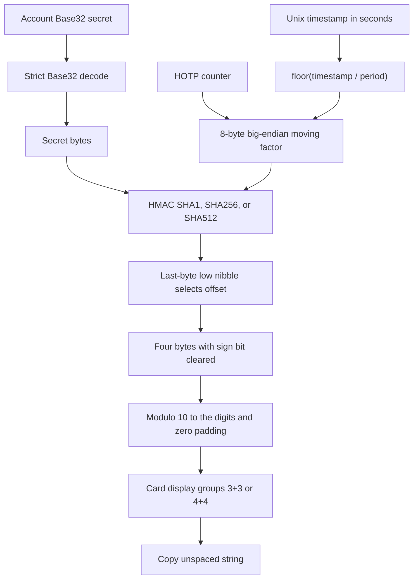

# OTP account, Base32, and calculation contracts

An OTP code is a **fixed-width decimal string**, not a number. Its meaning depends on the decoded secret, algorithm, digit count, and moving factor. Labels and persistence metadata do not enter HMAC. Keep these boundaries intact when changing ingestion, cryptography, or card presentation.

## Account configuration versus runtime state

[`OtpAccount`](../../src/types/otp.ts) carries `id`, `type`, optional `issuer`, `account`, `secret`, `algorithm`, `digits`, `period`, `counter`, and `createdAt`. The type permits `totp` or `hotp`, algorithms `SHA1`, `SHA256`, or `SHA512`, and 6 or 8 digits. Both moving-factor fields exist on every account; TOTP generation uses `period`, whereas HOTP generation uses `counter`. `ParsedOtpAuthUri` omits `id` and `createdAt`: a URI describes token configuration, not persisted identity.

**Units are not interchangeable:** `createdAt` is Unix epoch milliseconds; engine timestamps and `TotpCard.currentTimestamp` are Unix epoch seconds. `period` is seconds. HOTP `counter` counts events, not elapsed time. The account interface documents defaults but does not itself apply runtime validation.

| Setting | URI ingestion | Engine behavior |
| --- | --- | --- |
| Algorithm | Defaults to `SHA1`; trims, uppercases, removes `-` and `_`; rejects unsupported values | Same three hashes; `normalizeAlgorithm` uppercases and removes separators but does not trim; account wrappers fall back to `SHA1` for falsy values |
| Digits | Defaults to 6; accepts parsed value 6 or 8 | Wrappers use `account.digits || 6`; `formatOtp` rejects values other than 6 or 8 |
| Period | Defaults to 30; positive parsed value for TOTP | Generation rejects nonfinite or nonpositive defined periods; missing period defaults to 30 |
| Counter | Required, nonblank, and parsed nonnegative for HOTP; TOTP returns 0 | HOTP override wins over account counter; nullish account counter defaults to 0 |

These are **actual checks, not a complete schema guarantee**. URI numeric parameters use `parseInt(..., 10)`, so strings such as `digits=6abc`, `period=30.5`, or `counter=2tail` can be accepted as 6, 30, and 2. Engine period checks do not require an integer despite their error message. Counter serialization rejects negative, fractional, or nonfinite numbers, but does not check `Number.isSafeInteger` or an upper 64-bit bound; it writes `BigInt(counter)` with `DataView.setBigUint64`. The persisted model uses `number`, even though raw HOTP and `counterToBytes` accept `bigint`. Do not assume arbitrary 64-bit counters retain precision through the account model.

## Canonical Base32 at the ingestion boundary

The implementation in [`services/otp/base32.ts`](../../src/services/otp/base32.ts) is also re-exported by [`services/crypto/base32.ts`](../../src/services/crypto/base32.ts); these are not competing codecs.

- `sanitizeBase32` removes whitespace, hyphens, underscores, and periods, then uppercases. Sanitizing alone is not validating and does not remove padding.
- `validateBase32` returns `{ isValid, error?, cleaned }`. Successful `cleaned` is uppercase and unpadded. It rejects empty sanitized input, characters outside `A-Z` and `2-7`, misplaced padding, padded lengths not divisible by 8, invalid padding counts, unpadded length residues 1, 3, or 6 modulo 8, and nonzero unused trailing bits.
- `decodeBase32` applies the same structural checks and defaults to strict trailing-bit checking. `{ strict: false }` relaxes only the residual-bit check. Empty sanitized input decodes to an empty byte array, unlike validation.
- `encodeBase32` emits canonical uppercase data with zero unused bits and defaults to padding; use `{ pad: false }` for the unpadded form.

The account generation wrapper rejects an empty or whitespace-only string before decoding, but does not recheck byte length after sanitization. Raw generators also do not enforce a nonempty key. Thus URI validation is a stronger ingestion boundary than calling raw generation, and there is no secret-strength/minimum-length policy in these codec checks. Preserve strict residual-bit validation when accepting user secrets: different spellings with nonzero unused bits should not silently become interchangeable account secrets.

## URI parsing, issuer rules, and round trips

[`parseOtpAuthUri`](../../src/services/otp/uriParser.ts) trims input, requires `otpauth://`, accepts only `totp`/`hotp` hosts, decodes the label, and requires a nonempty account name and valid Base32 secret. A label decoding failure falls back to the raw path. Unknown query parameters are ignored. Parser failures carry the `URI_PARSE_ERROR:` prefix.

Issuer resolution is intentionally asymmetric:

1. A nonempty trimmed query `issuer` wins over the label issuer; a mismatch is not an error.
2. If the decoded label begins with that issuer plus `:` case-insensitively, that whole prefix is removed. This also supports issuers containing colons.
3. Otherwise the first colon separates issuer from account; subsequent colons belong to the account. With no colon, the whole trimmed label is the account.

TOTP rejects the **presence** of `counter`, even if empty. HOTP rejects the presence of `period` and requires a counter. The resulting configuration still includes both `period` and `counter`, using the inactive defaults 30 and 0 respectively.

`generateOtpAuthUri` percent-encodes issuer and account separately, emits `[Issuer:]Account`, repeats a nonempty issuer in the query, omits default `SHA1`, 6 digits, and TOTP period 30, and always includes a HOTP counter. It checks type and nonblank account/secret, but **does not fully validate configuration**. Its secret cleanup removes whitespace, hyphens, underscores, and `=`, but not periods, unlike the codec sanitizer.

Round-trip integrity means configuration preservation for valid normalized inputs, not byte-for-byte URI preservation. Defaults, unknown parameters, metadata, padding, and formatting are not retained. The tested contract is `parseOtpAuthUri(generateOtpAuthUri(config))` for ordinary normalized TOTP/HOTP configurations; a parsed URI can similarly be regenerated into compact form. Do not generalize this to every typed object: an issuerless account containing a colon can be reinterpreted as an issuer prefix, and inactive moving-factor values are not serialized. Validate at ingestion rather than using generation as a validator.

```ts
const config = parseOtpAuthUri(
  'otpauth://totp/Acme:alice?secret=jbsw-y3dp%20ehpk-3pxp&issuer=Acme'
);
const compactUri = generateOtpAuthUri(config);
const reparsed = parseOtpAuthUri(compactUri);
```

See [account ingestion](../workflows/account-ingestion.md) for creating persisted accounts, and [backup and transfer](../workflows/backup-and-transfer.md) for transfer boundaries.

## Shared calculation pipeline

[`otpEngine.ts`](../../src/services/crypto/otpEngine.ts) provides account wrappers and raw generators. TOTP is HOTP with `floor(timestampSeconds / period)` and epoch origin zero. Generation is synchronous and does not advance account state.



*Both token types share HMAC, 31-bit dynamic truncation, and fixed-width formatting; only their moving-factor source differs.*

Dynamic truncation requires a digest of at least 20 bytes, uses the low four bits of the **last digest byte** as the offset, and clears the high bit of the selected four-byte value. Formatting reduces modulo `10 ** digits` and pads with zeros. Keep those zeros in storage-independent API results and clipboard text.

`getTotpProgress` is presentation math: it computes remaining seconds from floored seconds, fractional progress clamped to `[0, 1]`, and urgency at remaining seconds `<= 5`. At a period boundary it returns a full period, not zero. It validates period but does not independently validate the supplied timestamp like generation does.

## Verification is a search, not account mutation

- `verifyTotp(token, account, timestamp, window = 1)` searches offsets from `-window` through `+window`, skips negative steps, and returns the first match as `{ valid: true, delta }`; otherwise `{ valid: false }`. `delta` is in periods, not seconds.
- `verifyHotp(token, account, currentCounter?, lookAheadWindow = 10)` searches inclusively from the starting counter through start plus look-ahead, returning `{ valid: true, matchedCounter }` or `{ valid: false }`.

Neither verifier mutates counters or records consumed tokens. There is no replay ledger or rate limiting in these helpers. Comparison rejects unequal lengths early and accumulates character differences for equal-length strings; this is not a guarantee that the complete verification operation has constant latency. Tokens are compared exactly without trimming display spaces. Windows have no explicit bounds/integer validation, and malformed configuration may throw rather than return `valid: false`; callers must constrain input and handle errors.

## Cards and HOTP state ownership

Both [`TotpCard`](../../src/components/otp/TotpCard.tsx) and [`HotpCard`](../../src/components/otp/HotpCard.tsx) catch generation errors and display `------`, even for an eight-digit account. Copy handlers refuse that placeholder or an empty code. Valid display text is grouped 3+3 or 4+4, while `copyWithAutoClear` and `onCopy` receive the original unspaced string. TOTP progress failures separately fall back to 30 seconds, progress 1, and nonurgent state; that fallback does not prove a code is valid.

HOTP copy does not increment. Its increment button awaits `onIncrement(account)`, guards while busy, and restores busy state in `finally`; the card does not own durable counter updates. The engine's `incrementHotpCounter` returns a copied account with counter plus one and its new code, without persistence or a type check. The storage method instead checks that the ID exists and is HOTP, performs the update inside `enqueueWrite`, generates the next code, and persists before returning. `useVault.incrementHotp` reloads accounts after that operation. Preserve this ownership split rather than advancing a local card counter before durable state is updated; see [encrypted vault](../architecture/encrypted-vault.md).

## Regression checks before changing the contract

Run the focused suites with the repository's Jest setup:

```sh
npx jest --runInBand __tests__/unit/rfc4226.test.ts __tests__/unit/rfc6238.test.ts __tests__/unit/base32.test.ts __tests__/unit/uriParser.test.ts __tests__/unit/TotpCard.test.tsx __tests__/unit/HotpCard.test.tsx
```

The RFC 4226 suite checks Appendix D counters 0–9, raw versus account generation, intermediate truncation values, eight-digit formatting, forward-only verification, increment behavior, and serialization above `2 ** 32`. The RFC 6238 suite checks Appendix B timestamps across all three algorithms using their corresponding secrets, derived six-digit results including `005924`, custom 60-second periods, fractional progress, boundary resets, and drift-window verification. These vectors are the algorithm-change acceptance baseline, not proof of validation for every malformed input.

For URI changes, retain defaults, issuer precedence, encoded labels, Base32 cleanup, required HOTP counters, and normalized serialize/parse round trips. Add explicit regression cases when tightening currently permissive numeric parsing or handling issuerless colon labels. For card changes, preserve invalid-code copy blocking and unspaced clipboard output. See [validation](../testing/validation.md) and [security boundaries](../architecture/security-boundaries.md) for broader testing and security context.
