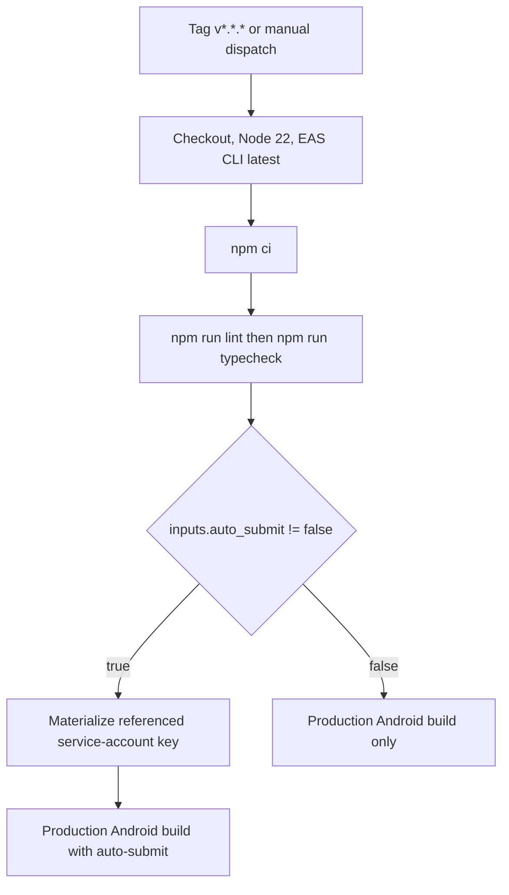

# Native configuration, builds, and releases

There are two independent delivery paths: the **mobile application**, built and signed with EAS, and the **VitePress documentation website**, deployed to GitHub Pages. The website is not the app's static web export, and deploying it does not publish a mobile release.

Use [Quickstart](../quickstart.md) for local setup, [Runtime](../architecture/runtime.md) for startup behavior, [Security boundaries](../architecture/security-boundaries.md) for offline constraints, [Localized companion](../architecture/localized-companion.md) for language/UI changes, and [Validation](../testing/validation.md) for wider test guidance.

## Start with the declared SDK, not remembered APIs

The root [package.json](../../package.json) declares **Expo `~57.0.26` (SDK 57)**, React Native `0.86.3`, and React `19.2.3`; the app entrypoint is `expo-router/entry`. Before changing Expo, EAS, or React Native APIs, follow [AGENTS.md](../../AGENTS.md): read the package's current major and consult the matching documentation, currently `https://docs.expo.dev/versions/v57.0.0/`. Use `https://docs.expo.dev/llms.txt` to locate additional specific documentation. Recheck the major after an upgrade rather than continuing to use this URL blindly.

Install SDK-compatible dependencies through Expo rather than a generic package-add command:

```bash
npx expo install <package>
npx expo-doctor
npx expo install --fix
npm run lint
npm run typecheck
```

`expo install --fix` changes dependency versions; inspect its diff. The repository guidance requires lint and typecheck before declaring a task complete. Expo Go contains only its bundled native modules: adding native code requires a new development build, not just restarting the JS server.

Local entrypoints are `npm start` (`expo start`), `npm run android` (`expo run:android`), `npm run ios` (`expo run:ios`), and `npm run web` (`expo start --web`). For EAS commands outside CI, repository guidance uses `npx eas-cli@latest` in a non-Bun project.

## Native configuration and generated output

[app.json](../../app.json) declares `Simple OTP`, slug `simple-otp`, app version `0.0.3`, scheme `simpleotp`, portrait orientation, and automatic appearance. Both the iOS bundle identifier and Android package are `vn.io.kd.simpleotp`. Android predictive-back support is disabled. EAS ownership/project association lives under `owner` and `extra.eas.projectId`; changing application identity is not an ordinary UI edit.

### Plugins and permission intent

| Configuration | Responsibility or declared intent |
| --- | --- |
| `expo-router` | Router native integration; `experiments.typedRoutes` is enabled. |
| `expo-splash-screen` | Orange `#F76B00` splash background, `splash-icon.png`, image width 120. |
| `expo-secure-store`, `expo-sharing` | Native secure storage and sharing integration. |
| `expo-camera` | Camera prompt for scanning 2FA QR codes; `microphonePermission: false` and `recordAudioAndroid: false`. |
| `expo-image-picker` | Photo-library prompt for importing QR codes from images. |
| `expo-local-authentication` | Face ID prompt for unlocking the vault. |
| `expo-localization` | Supported native locales `vi` and `en` on iOS and Android. |
| `expo-build-properties` | iOS `enableSceneSupport: true`. |

Android also explicitly declares `android.permission.CAMERA`, `android.permission.USE_BIOMETRIC`, `android.permission.USE_FINGERPRINT`, and **`android.permission.RECORD_AUDIO`**. The last declaration coexists with the camera plugin's `recordAudioAndroid: false`. Do not claim the release lacks microphone permission based on that plugin flag alone. Inspect the generated/merged Android manifest and the built artifact after plugin or dependency changes; other plugins and explicit permissions can contribute to the result. No Android native directory is present in the inspected root, so this page does not certify an Android merged manifest.

The iOS configuration enables mixed localizations, lists `vi`/`en`, and sets `ITSAppUsesNonExemptEncryption: false`. That is a configured declaration, not an independent assessment of export-compliance obligations.

### iOS already exists: configuration is not the whole artifact

An existing native project includes [ios/Podfile](../../ios/Podfile), `ios/SimpleOTP.xcodeproj`, and `ios/SimpleOTP.xcworkspace`. The conditional CNG guidance in `AGENTS.md` about absent native directories must not be read as “this repository has no native project.” Prefer app configuration/plugins for reproducible changes, but review how they reach the existing native project before release; do not regenerate or hand-edit indiscriminately.

The inspected [Info.plist](../../ios/SimpleOTP/Info.plist) contains the camera, photo-library, and Face ID usage strings and the `EXExpoAppSceneDelegate` scene configuration. It also contains Expo Dev Launcher local-network/Bonjour declarations. These are development integration details, not evidence that vault operations need a network connection.

There is visible version drift: `app.json` and root `package.json` say `0.0.3`, while the inspected plist has `CFBundleShortVersionString` `0.0.1` and `CFBundleVersion` `1`. Verify the actual production artifact and remote version state; do not infer the shipped iOS version from one source file.

`web.output` is `static`, but a static export is not proof of full native feature parity. Vault storage directly uses `expo-secure-store` and `expo-file-system` for its key and encrypted file. Treat browser support for storage, authentication, camera/import, and sharing as a separate validation problem, not something established by `npm run web` succeeding.

## EAS profiles and submission targets

[eas.json](../../eas.json) requires EAS CLI `>= 16.0.1`, selects `appVersionSource: "remote"`, and enables `autoIncrement` for production. Remote app-version management and production increments are distinct from the human-readable version fields checked into the repository.

| Profile | Build behavior | Android artifact |
| --- | --- | --- |
| `development` | `developmentClient: true`, internal distribution | APK |
| `preview` | Internal distribution, no development-client flag configured | APK |
| `production` | Auto-increment enabled; `EAS_BUILD_NO_EXPO_GO_WARNING=true` | AAB (`app-bundle`) |

For example, select the profile explicitly rather than assuming every EAS build is store-ready:

```bash
npx eas-cli@latest build --platform android --profile development
npx eas-cli@latest build --platform android --profile preview
npx eas-cli@latest build --platform android --profile production
npx eas-cli@latest submit --platform android --profile production
```

The `production` submit profile sends Android releases to Google Play's **`internal`** track with `releaseStatus: "completed"`, using the referenced credential path `./credentials/pc-api-key.json`. “Production build” therefore does **not** mean public Play production-track rollout. The iOS submit configuration specifies `ascAppId: "6816673973"`; the inspected Android workflow does not automate iOS release.

Keep credentials out of documentation and logs. The relevant CI secret names are **`EXPO_TOKEN`** and **`GOOGLE_SERVICE_ACCOUNT_KEY`**. Only their names and the credential path are needed here; never read or copy the credential payload to diagnose configuration.

## Android CI: actual gates and branching

[deploy-android.yml](../../.github/workflows/deploy-android.yml) runs on pushed tags matching `v*.*.*` or manual dispatch. Manual dispatch exposes a required boolean `auto_submit` with default `false`. Concurrency is grouped by workflow and ref, with `cancel-in-progress: true`.


The Android workflow chooses submission only after dependency installation and lint/typecheck.

The EAS setup action authenticates with `EXPO_TOKEN`. After checks, the workflow uses the same `inputs.auto_submit != false` condition both to materialize `credentials/pc-api-key.json` and to run:

```bash
eas build --platform android --profile production --auto-submit --non-interactive
```

The complementary `inputs.auto_submit == false` branch runs the same production build without `--auto-submit`. Manual `false` is build-only; manual `true` enables submission. Tag events do not supply a manual boolean input. GitHub's loose comparison of that absent input with `false` selects the build-only branch under the current expression; do not assume a version tag automatically submits to Play. If changing this policy, make the event-specific intent explicit and verify Actions expression behavior.

There is **no Jest test step**, native device test, or docs-build gate in this workflow. Lint/typecheck failures stop subsequent release steps under normal Actions step behavior. Successful CI checks are not proof that permissions, biometric prompts, vault persistence, or release-mode native integration work.

## Documentation website deployment

The separate [docs/package.json](../../docs/package.json) uses VitePress `^1.6.4` and provides `dev`, `build`, and `preview` scripts. Local website checks run in that package:

```bash
cd docs
npm ci
npm run build
npm run preview
```

[config.mts](../../docs/.vitepress/config.mts) uses base `/simple-otp/`, English and Vietnamese navigation, and local search. Its root-page redirect selects a locale using saved `simple_otp_lang` or browser language. If moving the hosting path, review both the base setting and the embedded redirect/favicon paths; updating only one leaves inconsistent URLs.

[deploy-docs.yml](../../.github/workflows/deploy-docs.yml) triggers on pushes to `main` affecting `docs/**` or the workflow itself, plus manual dispatch. It uses Node `lts/*`, caches against `docs/package-lock.json`, checks out full history, configures Pages, runs `npm ci` and `npm run build` inside `docs`, then uploads `docs/.vitepress/dist`. A dependent job deploys that artifact into the `github-pages` environment. Permissions are `contents: read`, `pages: write`, and `id-token: write`; concurrency uses group `pages` without cancelling in-progress deployments. It contains no mobile build, EAS submit, lint, typecheck, or Jest step.

## Preserve the offline boundary while changing delivery

The app's root layout installs the network blocker at module startup. It intercepts available JS `fetch`, `XMLHttpRequest`, `WebSocket`, `EventSource`, and `sendBeacon`; remote calls are rejected/thrown or return `false`, with violation recording. Production local-resource exceptions exist for fetch/XHR, while tests disable those exceptions. This is a JS runtime boundary, **not a guarantee about every native SDK's network behavior**.

EAS and GitHub Pages require network access in the delivery environment; that does not justify relaxing the app's runtime perimeter. When adding a native SDK or plugin, review native behavior and production permissions as well as JS requests. Do not introduce analytics, remote assets, or update-fetch behavior merely because build tooling is online. `AGENTS.md` mentions `eas update` as general tooling guidance, but the inspected release workflow contains no OTA-update step.

Recommended focused validation before publishing:

- Run lint/typecheck and dependency diagnostics for SDK/API changes; rebuild the native development client after native dependency changes.
- Inspect final iOS plist and Android merged manifest for permissions, locale declarations, identifiers, and version values. Validate prompts and denial paths on devices in the intended build profile.
- Run `npm test -- --runTestsByPath __tests__/unit/networkBlocker.test.ts` after perimeter-affecting changes. This suite checks blocked calls and violation recording; it does not certify native traffic or store readiness.
- Smoke-test offline launch, unlock, vault persistence, QR ingestion, and backup/sharing on a release-like build. These are recommended checks, not gates already present in CI.
- Build and preview VitePress separately for website changes, including `/simple-otp/` and both locale routes.

> **Do not use `npm run reset-project` to reset a vault or repair a build.** [reset-project.js](../../scripts/reset-project.js) destructively restructures source: it moves `src` and `scripts` into `example` on `y` (the default), or recursively deletes them on `n`, then creates blank `src/app/index.tsx` and `_layout.tsx`. It is a starter-project reset, not a device-data/vault reset or release-cleanup operation.
