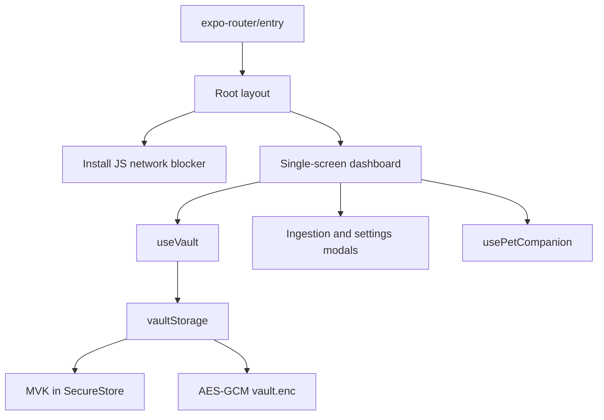

# Getting started and the safe-change map

Simple OTP is a mobile-first Expo/React Native authenticator with TOTP and HOTP accounts, a local encrypted vault, import and backup workflows, and an English/Vietnamese interface with a Pet Companion. Start here to choose the right implementation boundary; use the linked domain pages for detailed contracts and failure cases.

The current manifests declare app version **0.0.3**, **Expo `~57.0.26` (SDK 57)**, **React `19.2.3`**, **React Native `0.86.3`**, and **TypeScript `~6.0.3`**. Navigation enters through `expo-router/entry`, not a hand-written `App.tsx`. Check [package.json](../package.json) and [app.json](../app.json) before upgrading rather than relying on older project notes.

## Run the project

From the repository root:

```bash
npm install
npm run start
```

The start script runs `expo start`. For specific targets:

```bash
npm run ios
npm run android
npm run web
```

`ios` and `android` run `expo run:ios` and `expo run:android`, respectively: they build/run native applications, rather than merely selecting a target in the Metro menu. `web` runs `expo start --web`; the web configuration uses static output.

**Web preview is not proof of native capability.** The vault uses `expo-secure-store` and the native `File`/`Paths` storage APIs; authentication, camera/gallery permissions, screen protection, document picking, and sharing also require platform-specific verification. Use a native development build and a real device for security and permission-sensitive changes. Expo Go is a limited sandbox: [AGENTS.md](../AGENTS.md) explicitly requires a development build after adding native code not bundled in Expo Go. An EAS alternative is:

```bash
npx eas-cli@latest build --profile development --platform ios
```

The `development` profile enables a development client and internal distribution. See [Build and release](operations/build-and-release.md) for preview/production profiles, signing, permissions, and submission.

The [README](../README.md) is still a generic Expo starter guide. Do not use its `reset-project` suggestion as a normal maintenance step: it describes replacing starter code with a blank app, not a safe way to modify this authenticator.

## Know the runtime boundary before editing

`src/app/_layout.tsx` imports the crypto polyfill and i18n setup, installs the network blocker at module startup, and renders the themed Router stack and splash overlay. `src/app/index.tsx` is the single-screen dashboard: it coordinates account cards, ingestion, settings, QR transfer, privacy overlay, and companion UI.


*The main entry and account-state ownership boundaries; detailed lifecycle behavior belongs in the domain pages.*

`useVault` owns the dashboard account snapshot, search, and shared one-second clock, and resynchronizes time on foregrounding. Its mutation methods await storage and then reload accounts into React state. Preserve that storage-to-UI ordering when adding operations. Load failures are logged and end the loading state, so an empty-looking dashboard alone is not evidence that the vault is healthy.

The offline perimeter intercepts JavaScript `fetch`, `XMLHttpRequest`, `WebSocket`, `EventSource`, and `sendBeacon`; production local-resource exceptions exist for fetch/XHR. This is a runtime API boundary, **not an OS firewall or proof that every native library is network-free**. Do not casually add remote issuer icons, analytics, or cloud synchronization. See [Security boundaries](architecture/security-boundaries.md) before adding integrations.

## Route a task, not a directory

| Task | Start here | Boundary to preserve and focused validation |
| --- | --- | --- |
| Change OTP calculation, secret handling, or account parameters | [OTP contracts](concepts/otp-contracts.md); `src/services/crypto/otpEngine.ts`, `src/services/otp/uriParser.ts`, `src/types/otp.ts` | Keep Base32 and URI handling consistent with calculation and display. Run `rfc4226`, `rfc6238`, `base32`, `uriParser`, and the affected card tests. |
| Add or change camera, image, clipboard, or manual import | [Account ingestion](workflows/account-ingestion.md); dashboard handlers and `src/services/ingestion/` | Follow parsing, validation, duplicate handling, and save completion through to UI feedback. Test `ingestion`, `scanner`, and the affected entry modal, then exercise permission denial/cancellation natively. |
| Change persistence, deletion, or HOTP counter updates | [Encrypted vault](architecture/encrypted-vault.md); `useVault` and `vaultStorage` | The 32-byte MVK is stored in SecureStore; the account file is AES-GCM encrypted. Preserve queued writes and post-write UI reloads. Run `storage` and `useVault` tests; check concurrent mutations and failure paths. |
| Change app lock, background privacy, capture protection, or clipboard handling | [Security boundaries](architecture/security-boundaries.md); `PrivacyShield`, `privacyShieldManager`, and `src/services/security/` | The overlay subscribes to shield/lock state and delegates biometric unlock to the manager. Do not treat visual hiding as key erasure. Run privacy, biometrics, clipboard, and network-blocker tests, plus device lifecycle checks. |
| Change backup, restore, or account transfer | [Backup and transfer](workflows/backup-and-transfer.md); `SettingsModal`, `src/services/backup/backupCipher.ts`, `AccountQrModal` | Backup export encrypts before sharing; restore decrypts before choosing merge/replace. Replace resets the vault before sequential saves. Account QR transfer uses an `otpauth` URI and exposes the reusable secret, not just a short-lived code. Test backup, settings, and QR behavior, including interrupted restore. |
| Change dashboard composition, clock/search, or modal coordination | [Runtime](architecture/runtime.md); `src/app/index.tsx` and `useVault` | Keep non-route logic outside `src/app/` as directed by AGENTS.md. Run `HomeScreen`, `useVault`, and affected component tests. |
| Change language, mascot reactions, preferences, or Academy content | [Localized companion](architecture/localized-companion.md); `usePetCompanion`, i18n, and pet services | Dashboard account count, timer urgency, and copy feedback feed the companion; settings owns language/pet controls. Run i18n, companion-hook, dialogue, preference, and Academy tests as appropriate. |
| Upgrade Expo or change permissions, plugins, builds, or release metadata | [Build and release](operations/build-and-release.md); manifests and `eas.json` | Consult SDK-matched documentation and keep native configuration aligned with runtime behavior. Validate dependency/config health and rebuild native targets; web preview is insufficient. |

## Validate before calling a change done

[AGENTS.md](../AGENTS.md) requires lint and typecheck before completion. The repository already has Jest infrastructure; no testing setup needs to be invented from the starter README.

```bash
npm run lint
npm run typecheck
npm test -- --runInBand
```

Choose the narrowest relevant tests while iterating, then broaden for cross-domain changes. For example:

```bash
npm test -- --runInBand __tests__/unit/rfc4226.test.ts __tests__/unit/rfc6238.test.ts
npm test -- --runInBand __tests__/unit/storage.test.ts __tests__/unit/useVault.test.tsx
npm run test:coverage
```

`test` disables watch mode, `test:watch` enables it, and `test:coverage` collects coverage. Jest uses `jest-expo` and discovers tests under `__tests__`, including unit, adversarial, and files labeled `e2e`. Do not infer device automation from that label: the tier feature tests invoke a TypeScript harness, and storage unit tests replace SecureStore and file-system operations with in-memory mocks. Passing them does not prove Keychain/Keystore, OS permissions, biometric prompts, or share-sheet behavior on a device. See [Validation strategy](testing/validation.md) for test selection and evidence limits.

For dependency or Expo configuration changes:

```bash
npx expo-doctor
npx expo install <package>
npx expo install --fix
```

Use `expo install` for SDK-compatible dependencies; `--fix` is a corrective command, not an automatic prerequisite for every edit. Read the SDK 57 documentation at https://docs.expo.dev/versions/v57.0.0/ before changing Expo APIs, as required by AGENTS.md. Report exactly which checks ran, preserve complete failure output, and distinguish mocked tests, web observations, simulator checks, and real-device verification.
