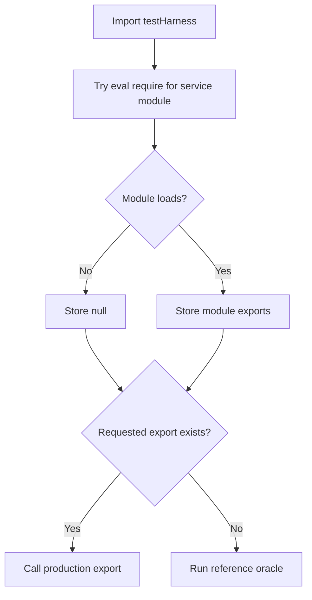

# Testing strategy and evidence for changes

A useful change proof identifies **which implementation ran, which boundary was mocked, and which invariant was asserted**. A passing contract simulation is not proof of native behavior, and a directory named `e2e` is not proof of a device-driven journey.

Use the repository's [test infrastructure guide](../../TEST_INFRA.md) as a requirements map, not as evidence that today's checkout passes. This page does not report a current pass count or coverage percentage. Historical status statements and checked-in coverage artifacts must not substitute for a fresh run against the changed revision.

## Choose the evidence layer

- **Direct service unit tests** are the first choice for algorithm and persistence changes. For example, `rfc6238.test.ts` imports the production OTP engine directly and checks published RFC vectors. `storage.test.ts` imports `VaultStorage` directly, but replaces SecureStore and files with Maps and replaces HOTP output with `HOTP_${counter}`. Pair storage assertions with the RFC suite rather than treating that mock output as cryptographic verification.
- **Component and hook tests** exercise React behavior through `react-test-renderer` and `act`, with native or service mocks. They are useful for callbacks, visible state, and async transitions, not native layout, animation fidelity, permission dialogs, or platform presentation.
- **Contract tiers under `__tests__/e2e/`** broaden representative inputs, boundaries, combinations, and workflow simulations. Tier 1 imports `testHarness`, not the app's UI entrypoint. Inspect the adapter before attributing its assertions to production.
- **Adversarial hardening** adds direct production imports and deliberately malformed inputs, rejected dependencies, concurrency, and timing. In `tier5_crypto_storage_hardening.test.ts`, real cipher/service logic runs over virtual native storage and clipboard boundaries; it is not a physical-device security assessment.
- **Device validation** closes the gap at OS permissions, biometric prompts, app-switcher snapshots, capture protection, file providers, and sharing.

## The dynamic loader can silently change the subject of a test

[`testHarness.ts`](../../__tests__/helpers/testHarness.ts) attempts `eval('require')(moduleName)` once at module initialization for the OTP engine, Base32, backup facade, and vault storage. **Any loading exception is caught and becomes `null`**: not only a missing file, but also resolution, transformation, or initialization failures.

Each delegated helper then checks for a particular export. If present it calls production; otherwise it executes its own reference implementation. Delegation is per helper, not an all-or-nothing production mode. The reference implementation uses actual `@noble/hashes` and `@noble/ciphers` primitives, but remains test code.


The adapter's loading and export checks determine which code a contract assertion actually exercises.

A concrete trap is `createVaultStorageService`: the harness delegates only to an export of that name, whereas the current production storage module exports `VaultStorage` and `vaultStorage`, not that factory. Consequently the harness factory uses its in-memory Map, with simulated initialization and no encrypted file persistence. Its CRUD or recovery journey must not be cited as proof that SecureStore or `vault.enc` works.

The harness also provides local biometric and privacy-shield simulators, and a `NetworkBarrier` that intercepts only global `fetch`. These do not validate native Face ID or the production network interceptor's other APIs. When extending a contract, add a direct-import test for the production boundary; if production execution is required, make module resolution/export failures fail visibly rather than accepting fallback as change proof.

## Change-to-test matrix

Paths below are relative to `__tests__/unit/` unless a directory is given. Run the focused tests first, then related integration and full-suite checks. The last column describes additional evidence to collect, not a claim that those device checks are automated.

| Change area | Focused suites | Important assertions and remaining boundary |
|---|---|---|
| RFC engine, Base32, URI parser | `rfc6238.test.ts`, `rfc4226.test.ts`, `base32.test.ts`, `uriParser.test.ts`; `e2e/tier1_features.test.ts` and `e2e/tier2_boundaries.test.ts` | Published expected codes, leading zeros, time-step edges, algorithm/digit/period choices, malformed encoding and URI parameters. Check whether the tier helper actually delegates. See [OTP contracts](../concepts/otp-contracts.md). |
| Storage, encryption, concurrency | `storage.test.ts`, `backup.test.ts`, `cryptoStress.test.ts`, `useVault.test.tsx`; `adversarial/tier5_crypto_storage_hardening.test.ts` | MVK reuse, encrypted reload, tampering, failed writes, HOTP persistence, concurrent mutations. Tier 5 includes corrupted MVK, cold persistence, envelope/schema guards, and 50 interleaved writes. Maps do not prove disk durability or hardware key protection. See [encrypted vault](../architecture/encrypted-vault.md). |
| Ingestion and duplicate routing | `ingestion.test.ts`, `scanner.test.ts`, `ManualEntryModal.test.tsx`, `CameraScannerModal.test.tsx`, `IngestionSheet.test.tsx`; Tier 5 | Clipboard detection/cache, normalized secrets, manual validation, camera dispatch, duplicate handling, rejected vault writes. Validate actual permission denial and QR acquisition on a device. See [account ingestion](../workflows/account-ingestion.md). |
| Biometrics and AppState | `biometrics.test.ts`, `privacyShield.test.ts`, `biometricLoopFix.test.ts`, `PrivacyShieldComponent.test.tsx`, `RootLayout.test.tsx` | Concurrent authentication rejection, transient `inactive` versus real `background`, return-to-foreground unlock, shield and listener lifecycle. The loop regression uses production managers with mocked authentication/capture APIs; it does not open Face ID. |
| Clipboard and network perimeter | `clipboardClear.test.ts`, `networkBlocker.test.ts`; Tier 5 | Timeout cancellation, partial/full elapsed resume, preserving user-replaced clipboard content, blocked network APIs. Do not equate the harness's fetch-only barrier with the production perimeter. See [security boundaries](../architecture/security-boundaries.md). |
| Modal and screen orchestration | `HomeScreen.test.tsx`, `SettingsModal.test.tsx`, `AccountActionSheet.test.tsx`, `EditAccountModal.test.tsx`, `RenameAccountModal.test.tsx`, `AccountQrModal.test.tsx` | Visibility, submit/cancel callbacks, validation errors, selection/reset, and async outcomes. Settings tests mock Sharing, DocumentPicker, and files: confirm actual share/restore separately. See [backup and transfer](../workflows/backup-and-transfer.md). |
| Mascot and localization | `mascotState.test.ts`, `petStorage.test.ts`, `petDialogues.test.ts`, `usePetCompanion.test.tsx`, `PetCompanion.test.tsx`, `SpeechBubble.test.tsx`, `i18n.test.ts`, `LanguageWelcomeModal.test.tsx` | State precedence, transient copied feedback, saved preferences, language switching and translated UI. Test-runner initialization differs from device startup. See [localized companion](../architecture/localized-companion.md). |

The production vault serializes writes through an instance-owned Promise queue. Concurrency evidence should assert the final persisted state, not merely that every Promise resolved, and should not be generalized to independent instances or crash-safe filesystem transactions.

## Runtime assumptions to preserve

### Timers and cleanup

Timing tests use `jest.useFakeTimers()` to control elapsed time; for example the pet hook suite tests transient copied state, and Tier 5 drives clipboard resume before and after expiry. Advance timers deliberately, flush asynchronous work inside `act` for React tests, and restore real timers afterward. Reset caches, virtual storage, spies, and AppState subscriptions between cases. A fake-clock deadline proves scheduling logic under that clock, not OS background execution or real animation timing.

Not every timing test uses fake time: `biometricLoopFix.test.ts` includes a real short timeout for startup auto-unlock. Do not globally switch its timer model without accounting for awaited startup work.

### Jest configuration and native substitutions

[`jest.config.js`](../../jest.config.js) uses `jest-expo`, loads `jest.setup.js` after environment setup, maps `@/` to `src/` and `@/assets/` to `assets/`, and maps stylesheet imports to the setup file. Its transform allowlist includes React Native, Expo, navigation, SVG, `@noble/hashes`, `@noble/ciphers`, and `uuid`, with explicit exclusions for the Reanimated plugin and React Native Babel preset. Loader fallback can hide a transform problem, so investigate imports when a production change appears to have no effect on contract tests.

[`jest.setup.js`](../../jest.setup.js) supplies Node Web Crypto when absent, initializes i18n, and substitutes lucide icons with React Native Views. Individual suites supply further native mocks. These substitutions cannot demonstrate mobile entropy availability, native icon rendering, SecureStore policy enforcement, or file-provider behavior.

### `NODE_ENV === 'test'` is a different path

- i18n starts from `TEST_LOCALE` or `DEFAULT_LANGUAGE` in tests, rather than resolving the device locale. Its startup synchronization from saved language preference is skipped.
- The home screen skips its startup `isLanguageInitialized()` welcome-modal check in tests.
- `NetworkBlocker` treats no URL as an exempt local resource in tests. Outside tests it recognizes local schemes such as `file:`, `blob:`, `data:`, `assets-library:`, `ph:`, and paths beginning `/`.

Therefore language unit tests and a strict network-blocking result do not by themselves prove first-launch onboarding, saved-language hydration, or device local-resource behavior.

## Commands and review evidence

Run from the repository root. These commands follow the scripts in [`package.json`](../../package.json):

```sh
# Focused direct production checks
npm test -- --runTestsByPath __tests__/unit/rfc6238.test.ts __tests__/unit/uriParser.test.ts
npm test -- --runTestsByPath __tests__/unit/storage.test.ts __tests__/adversarial/tier5_crypto_storage_hardening.test.ts
npm test -- --runTestsByPath __tests__/unit/biometricLoopFix.test.ts

# Contract tiers, still in Jest rather than on a device
npx jest __tests__/e2e/ --watchAll=false

# Full checks
npm test
npm run test:coverage
npm run lint
npm run typecheck
```

Coverage collection targets `src/**/*.{ts,tsx}` and excludes declaration files. No `coverageThreshold` is configured in Jest: a generated percentage is not an enforced release threshold. Review coverage of changed branches alongside assertion quality and adapter selection; exercised oracle code does not establish production coverage.

For a review, record the revision, commands, actual results, relevant mocks/fallbacks, and device/build context. Distinguish “not run” from “passed.” See [build and release](../operations/build-and-release.md) for the surrounding operational workflow.

## Manual device checklist

Use an appropriate installed native build, and record platform, OS, enrollment, and permission state. Do not infer these outcomes from resolved native mock Promises.

- **Permissions and acquisition:** camera allowed/denied, recovery after denial, real QR scan, clipboard privacy prompts, document-provider cancellation and errors.
- **Face ID and lifecycle:** no enrollment, cancellation/failure, enabling lock, repeated taps, cold start, Control Center/system-alert `inactive`, actual background and resume. Verify that prompts do not loop and private content is hidden during transitions.
- **Screen capture:** screenshots/recording and app-switcher previews on each supported platform. Check visual exposure, not just whether a prevention API was called.
- **Share/restore:** export an encrypted `.simpleotp` file through the native share sheet, import through an actual provider, test cancellation, wrong password and damaged file, then verify restored accounts and HOTP counter continuity. Use disposable accounts and avoid logging secrets or passphrases.
- **Localization and UI:** first-launch language welcome, saved preference after relaunch, system language change on resume, modal presentation, long translated text, and companion feedback during copy/countdown interactions.

The release argument is the combination of direct production assertions, broader contract scenarios with known adapter selection, and explicit native observations—not any one tier's name or historical report.
