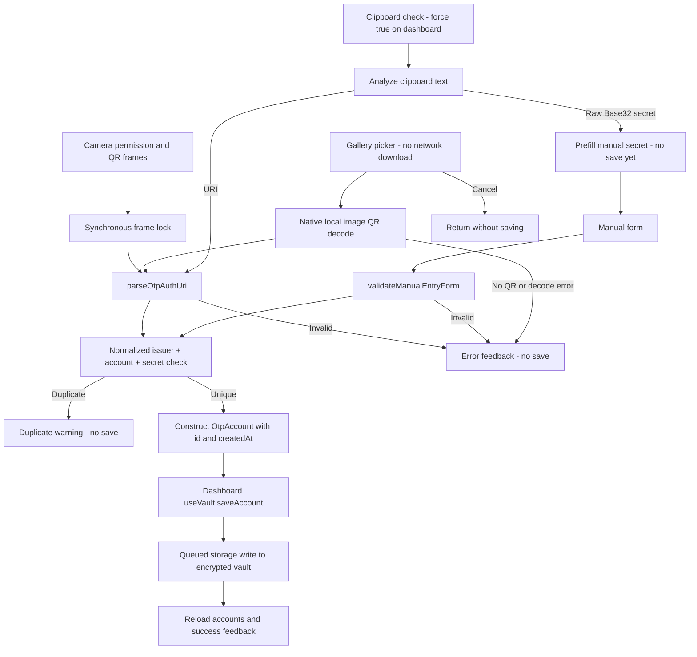

# Account ingestion through camera, images, clipboard, and manual entry

## Two orchestration paths, one duplicate rule

The dashboard owns the visible camera and manual modals and the gallery and clipboard actions. It does **not** send all inputs through `routeIngestion`: camera/gallery services and clipboard analysis parse data first, then dashboard handlers construct `OtpAccount` objects and call `useVault.saveAccount`. Manual entry constructs the account inside `ManualEntryModal`; the dashboard only saves it. Both paths reuse `findDuplicateAccount`.

Separately, [the ingestion router](../../src/services/ingestion/ingestionRouter.ts) offers a reusable intake API for callers with an account array or `VaultStorageService`. Its `camera` and `gallery` inputs are already-decoded URI strings, not device operations. This separation matters when changing validation or persistence: changing the router alone does not change dashboard account construction or error handling.

*Actual dashboard flow: device decoding and form validation precede UI-level duplicate checks; the reusable router is an alternative orchestrator, not an intermediate node in this flow.*

## Camera: permission, synchronous lock, and recovery

`CameraScannerModal` uses `useCameraPermissions`. Until permission is known it shows loading; when denied it offers a request button if `canAskAgain`, otherwise `Linking.openSettings`, plus a close action. The permitted preview uses the back camera, QR-only barcode settings, and a toggleable torch. Opening the modal resets the scan lock and turns the torch off. Switching to gallery closes the camera before invoking the gallery action.

`handleBarcodeScan` acquires `ScanLockController` **synchronously before parsing or callbacks**. A second frame returns `false` immediately. This ref-held controller, rather than asynchronously updated React state, blocks bursts of camera callbacks. Empty data causes a cooldown without an error callback. Non-`otpauth://` data produces `INVALID_URI_SCHEME`; parser failure produces `URI_PARSE_ERROR`. Both error paths schedule unlock after the default **1500 ms**, with warning/error haptics. The modal's error-alert cancel button can reset the lock sooner.

On successful parsing, the lock stays held until explicitly reset; success does not schedule a cooldown. In the dashboard, the success handler closes the camera immediately, checks for a duplicate, and saves a unique account without a separate confirmation sheet. A future confirmation UI would need to manage reset explicitly. The lock prevents repeated frames within one scanner session, **not** simultaneous ingestion from other channels.

See [scanner control flow](../../src/services/ingestion/scanner.ts) and [camera UI lifecycle](../../src/components/ingestion/CameraScannerModal.tsx).

## Gallery: local decoding and distinct outcomes

`pickAndScanGalleryQr` launches the system picker with `mediaTypes: ['images']`, `allowsEditing: false`, quality `1.0`, and `shouldDownloadFromNetwork: false`. It selects only the first asset. Cancellation, missing assets, or an empty asset list return `{ canceled: true }` and the dashboard silently stops.

The default `NativeCameraQrDecoder` calls `scanFromURLAsync(imageUri, ['qr'])`, trims results, and removes empty strings. This is an offline image-decoding path, not an upload service. A `QrDecoderEngine` can be injected for tests or a replacement decoder; preserving the no-network behavior is an important extension constraint.

No decoded strings returns `NO_QR_FOUND`. No string beginning with `otpauth://` returns `INVALID_URI_SCHEME`. The service chooses the **first scheme-matching string**, then parses it: a malformed first OTP candidate returns `URI_PARSE_ERROR`, even if a later candidate would parse successfully. Picker exceptions are thrown as `PERMISSION_DENIED_MEDIA_LIBRARY`; native decode exceptions are thrown as `DECODE_ENGINE_ERROR`. These thrown errors are distinct from the returned `{ canceled: false, error }` outcomes. The dashboard alerts on returned `error.userMessage` and catches thrown failures separately.

Permission check/request helpers exist for camera and media library, but this gallery function does not explicitly call them before launching the picker. Do not infer a gallery pre-permission screen from those helper APIs.

## Clipboard: detection is not authorization to save

[Clipboard analysis](../../src/services/ingestion/clipboard.ts) trims text and recognizes either a parsable `otpauth://` URI or a raw Base32 secret. Raw-secret detection rejects PEM/key/certificate-looking content, removes whitespace, hyphens, underscores and dots, uppercases the result, and requires at least 16 characters plus successful `validateBase32`. This is a detection heuristic, not the manual form's minimum-length policy.

`checkClipboard` checks for string content and catches read or permission failures as `{ detected: false }`. Its module-level `lastCheckedString` cache uses trimmed text and is updated before analysis, including for invalid text. Ordinary checks suppress repeated identical content; `{ force: true }` bypasses suppression, not validation. The dashboard explicitly uses this forced mode, so repeatedly pressing clipboard intake can still produce duplicate warnings.

For a URI, the dashboard uses the analyzed configuration, checks duplicates, constructs the account, and saves it. For a raw secret, it sets `manualInitialValues` to `{ secret: res.payload }` and opens manual entry. There is no immediate vault write: the user must supply the required account name and submit the form. The manual form's paste button is a separate operation that reads text directly and sends it through secret sanitization/validation, not URI analysis.

`subscribeClipboardDetection` is an optional service integration that checks on `background`/`inactive` to `active` transitions and returns an unsubscribe function. The dashboard's current ingestion code does not install this subscriber; service support for automatic detection should not be described as an active dashboard auto-import feature.

## Parsing and manual validation boundaries

URI inputs converge on `parseOtpAuthUri`: it checks the scheme and TOTP/HOTP type, extracts an account label, gives query `issuer` precedence over label issuer, validates Base32, and supplies SHA1/6-digit defaults. HOTP requires a counter and forbids a period; TOTP forbids a counter and defaults to period 30. Unknown query fields are tolerated. Numeric URI parameters use `parseInt`, so this is not a strict whole-string numeric grammar. See [OTP contracts](../concepts/otp-contracts.md) for the wider token model.

Manual validation lives in [manualInput](../../src/services/ingestion/manualInput.ts), not in vault storage. It requires a trimmed account name and valid Base32 secret, treats issuer as optional, normalizes type/algorithm, allows only 6 or 8 digits, and validates a positive integer TOTP period or nonnegative integer HOTP counter. Defaults are TOTP, SHA1, 6 digits, period 30 and counter 0. String period/counter values also use `parseInt`, whereas numeric fractional values fail the integer check.

`ManualEntryModal` sanitizes and validates secrets while editing. On submit it builds form values, validates, checks duplicates against `existingAccounts`, and calls `createOtpAccountFromManual`, which validates again and adds an ID and `createdAt`. The modal pre-converts period/counter with `parseInt(...) || 30` or `|| 0`; consequently some blank, invalid, or zero inputs become defaults before service validation. Only account and secret errors are surfaced inline by this handler. Cancellation does not save.

## Duplicate identity, persistence, and races

`findDuplicateAccount` compares the **entire normalized triplet**:

- issuer: missing becomes empty, then trim and lowercase;
- account: trim and lowercase;
- secret: remove whitespace, `-`, `_`, `=`, and `.`, then uppercase.

Type, algorithm, digits, period and counter do not participate. A changed secret under the same issuer/account is allowed as key renewal; the same secret under a different account or issuer is also allowed. This is different from storage uniqueness.

`VaultStorage.saveAccount` requires nonempty ID/account/secret and a valid type, then queues the read/check/append/encrypt/write operation. Its uniqueness check is **by `id` only**, not the triplet, and it does not repeat Base32 or full OTP-parameter validation. Persistence encrypts the account array with AES-GCM into `vault.enc`; the master key is stored in SecureStore. `useVault.saveAccount` awaits storage, reloads accounts, and updates mounted UI state. See [Encrypted vault](../architecture/encrypted-vault.md) and [Security boundaries](../architecture/security-boundaries.md).

The queue prevents overlapping storage read-modify-write operations, but does not make an earlier ingestion triplet check atomic with saving. Dashboard handlers capture an `accounts` snapshot; router helpers resolve accounts before saving. Two concurrent unique-ID candidates can therefore both pass the same triplet check and both be stored. Scanner frame locking does not solve this cross-channel race. An atomic triplet constraint would need to be enforced inside the queued storage operation or another shared ingestion transaction boundary.

UI feedback also has separate timing. Dashboard camera/gallery/URI-clipboard/manual handlers issue their success celebration after awaiting `saveAccount`. But the scanner and gallery service already emit success haptics after parsing, before persistence. Manual entry emits a success haptic, calls `onSave` without awaiting its promise, and closes immediately; it has no submitting lock or save-error recovery. Camera's asynchronous dashboard callback similarly has no local save-failure catch, while gallery and clipboard handlers have outer catches. Do not equate a haptic or modal dismissal with durable storage success.

## Reusable router contract

`routeIngestion` dispatches camera/gallery strings to `ingestFromUri`, manual objects to `ingestFromManual`, and clipboard detection objects to `ingestFromClipboard`. Results are `success`, `duplicate` with `existingAccount`, or `invalid` with an error. Raw-secret clipboard ingestion requires an account name supplied through `manualOverrides` or detection metadata, then uses manual validation.

The router can inspect an array or call a vault's `getAccounts`. Persistence is opt-in through `saveToVault` (default false) and requires an active vault, either the target vault or `options.vault`. Thus `success` can mean only that a candidate was built, including when saving was requested but no vault was supplied. `idGenerator` is injectable. Save failures become `invalid` with `Vault save error`; account-resolution failures are not caught by that save-error block. Duplicate outcomes never save.

## Focused verification

- [Scanner unit tests](../../__tests__/unit/scanner.test.ts) cover lock acquisition/reset/cooldown, valid and malformed frames, gallery cancellation and decode failures, offline picker settings, and permission helpers.
- [Ingestion unit tests](../../__tests__/unit/ingestion.test.ts) cover clipboard suppression/permission rejection/resume callbacks, manual defaults and invalid fields, normalized duplicate behavior, router dispatch, opt-in persistence, and save failures.
- [Adversarial ingestion tests](../../__tests__/adversarial/challenger_m2_ingestion.test.ts) stress 60-frame and 1000-frame bursts, recovery after invalid QR cooldown, multi-QR images, PEM rejection, forced clipboard checks, and duplicate normalization/key renewal.

The adversarial `CHAL-CONC-1` test first saves one account sequentially, then runs 19 parallel duplicate attempts against a mock vault that itself rejects duplicate writes. It verifies detection after an existing account is visible, **not** simultaneous first-insert triplet uniqueness in real storage. These test descriptions are coverage references, not a claim that tests were executed for this page.

For bulk imports and exported accounts, continue with [Backup and transfer](backup-and-transfer.md); for broader test strategy, see [Validation testing](../testing/validation.md).
