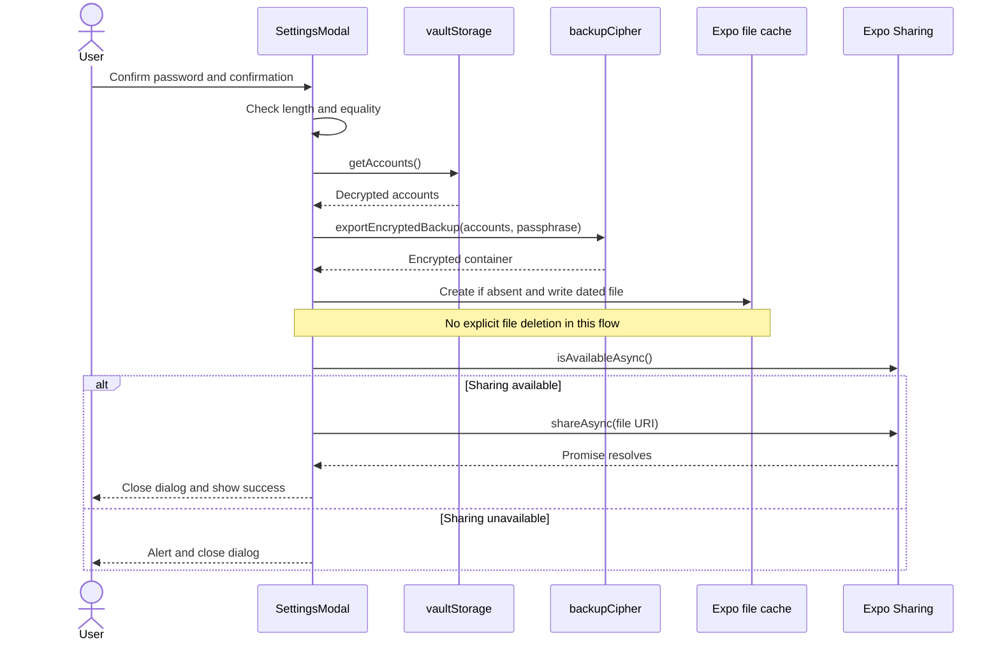
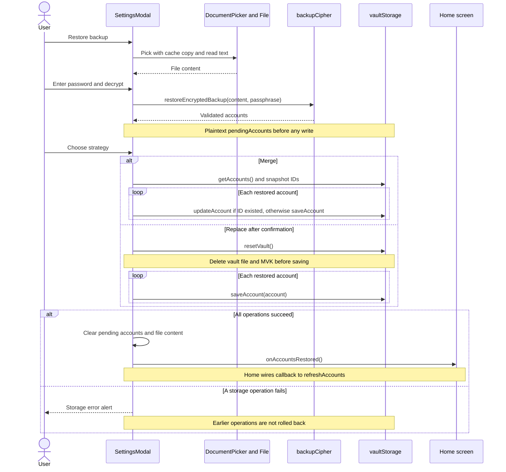

# Backup, restore, and QR account transfer

There are two different transfer boundaries:

- **Whole-vault backup** exports a password-encrypted JSON container as a `.simpleotp` file. Restore decrypts and validates it before asking how to apply the accounts.
- **Single-account QR transfer** displays an ordinary `otpauth://` URI containing the secret, plus a readable and copyable secret. It is not a password-encrypted backup. Treat a captured QR image as a credential, not as a harmless account label.

`SettingsModal` orchestrates file export and restore. The backup cipher performs encryption and payload validation without writing files or changing the vault. `vaultStorage` owns local persistence. `AccountQrModal` handles single-account disclosure. For the local encryption model see [Encrypted vault](../architecture/encrypted-vault.md); for incoming QR processing see [Account ingestion](account-ingestion.md).

## Export and share

Export starts by resetting the export password, confirmation, and error fields. The UI requires a passphrase of at least six characters and an exact confirmation match. This is **UI policy**, not an engine guarantee: `encryptBackup`, `decryptBackup`, and `deriveKey` only require a nonempty string. Restore likewise requires a nonempty password, not six characters, so engine-produced backups with shorter passwords remain importable.

After validation, the handler reads all accounts from `vaultStorage.getAccounts()`, calls `exportEncryptedBackup` (an alias of `encryptBackup`), and pretty-prints the resulting container. It writes `simpleotp_backup_YYYY-MM-DD.simpleotp` under `Paths.cache`, creating the file if absent and writing the same dated path again if present. Only encrypted container JSON is written by this handler, although account secrets and the password are present in memory during encryption.

The file is written **before** `Sharing.isAvailableAsync()` is checked. If sharing is unavailable, the UI alerts and closes the export dialog. Otherwise `Sharing.shareAsync` receives the file URI with `application/octet-stream` and `public.data`. A resolved share call leads to a success alert; it does not establish that the user saved an external copy. Export errors stay in the dialog, and `isExporting` is reset in `finally`.

*Export reads the local vault, encrypts accounts, writes a cache file, and only then enters the platform sharing boundary.*

Implementation: [export handlers](../../src/components/settings/SettingsModal.tsx#L212-L269).

## Backup format and cryptographic contract

The engine implementation is in [backupCipher](../../src/services/backup/backupCipher.ts); [the crypto-path facade](../../src/services/crypto/backupCipher.ts) re-exports it rather than implementing a second format.

| Layer | Written representation and behavior |
| --- | --- |
| Outer container | `format: 'simpleotp'` by default, `version: 1`, `createdAt`, `kdf`, `cipher`, `ciphertext`. An encryption option permits `'simpleotp-encrypted'`; restore accepts both format names, but only container version `1`. |
| KDF | `algorithm: 'PBKDF2-HMAC-SHA256'`, default `iterations: 100_000`, Base64 salt. PBKDF2-HMAC-SHA256 derives a 32-byte key. Salt is randomly generated as 16 bytes by default, with a minimum of 16 bytes when supplied or read. |
| Cipher | `algorithm: 'AES-256-GCM'`, Base64 IV and tag. The IV must be exactly 12 bytes and the tag exactly 16 bytes. Encryption separates the appended GCM tag from ciphertext; decryption rejoins `ciphertext || tag`. |
| Encrypted payload | JSON object with `version: 1`, `exportedAt`, `app: 'Simple OTP'`, and `accounts`. Account secrets, IDs, and OTP configuration are inside this encrypted payload. |

`EncryptBackupOptions` exposes salt, IV, iteration, and format overrides, including deterministic-test inputs. `deriveKey` rejects iteration counts below `10_000`. Decryption uses the container iteration count or the default if missing. The code does not impose an explicit upper bound or comprehensive numeric validation on that value. Do not extend untrusted import handling under the assumption that expensive KDF inputs are already bounded.

The container algorithm labels are emitted metadata, not algorithm negotiation: decryption always uses PBKDF2-HMAC-SHA256 and AES-GCM and does not validate those label values. It also supplies no additional authenticated data for outer metadata. Consequently, do not describe every metadata field as authenticated or claim that changing a timestamp or accepted format label must fail authentication. The test fixture named “V2” still has **container `version: 1`** and uses the alternate format and `kdf.algorithm: 'PBKDF2'`.

### Validation and errors

Restore accepts a container object or JSON string. Before attempting GCM decryption, it checks that the container is an object, has an accepted format and version, contains the required sections and cryptographic fields, and has valid decoded salt/IV/tag lengths. GCM authentication failure becomes:

`AUTH_FAILED: Decryption failed: invalid passphrase or corrupted backup`

This deliberately does not distinguish a wrong password from damaged ciphertext. After authentication, the plaintext must parse as JSON and contain either a direct accounts array or an object with an `accounts` array. The inner payload's `version`, `app`, and timestamps are not enforced as a separate schema.

Every extracted account must have a nonempty string `id`, an exact `totp` or `hotp` type, a nonempty string account name, and a string secret that passes Base32 validation. The returned object preserves those fields and issuer, defaults a falsy algorithm to `SHA1`, coerces digits to `8` only for an exact numeric `8` and otherwise `6`, and defaults nullish period, counter, and creation time to `30`, `0`, and `Date.now()`. This is not full OTP-parameter validation: algorithm allowlists and numeric ranges for period/counter are not enforced here, nor is uniqueness of IDs across the payload.

The UI maps any message containing `AUTH_FAILED` **or** `Decryption failed` to its wrong-password error. That also includes the engine's decrypted-payload JSON parse failure. Other errors display the restore error prefix plus the original message. Keep this mapping in mind when changing error strings; presentation currently depends on substrings rather than typed error codes. See [OTP contracts](../concepts/otp-contracts.md) for configuration semantics.

## Restore is validation first, then incremental persistence

The document picker permits broad file types and requests `copyToCacheDirectory: true`. Cancellation returns without opening the password dialog. The first selected asset is read as text into `restoreFileContent`; its name is used for display, not as the authority for format recognition.

Successful decryption stores plaintext accounts in `pendingAccounts`, hides the password dialog, and opens the strategy dialog. No vault writes happen during this step. Merge applies immediately when selected; replace requires a destructive confirmation alert.

*Restore validates before choosing merge or replace, but the persistence phase is a sequence of independent writes, not a transaction.*

### Merge means identity by `id`

Merge snapshots the current IDs into a `Set`. Each restored account whose ID was in that snapshot calls `updateAccount`; all others call `saveAccount`. Update replaces the stored account object, not selected fields. Existing accounts absent from the backup remain. Neither issuer/account name nor secret is used for deduplication, so otherwise identical credentials with different IDs coexist.

The ID set is not extended as accounts are saved. Duplicate new IDs within one backup can therefore save the first account and fail on the next one, because `saveAccount` rejects an existing ID. Duplicate IDs that existed before the merge instead repeatedly update the same account. Validation does not eliminate this case.

### Replace destroys the old vault and key first

`resetVault()` deletes `vault.enc`, deletes `simpleotp_vault_key` from SecureStore, then sets `cachedMvk` to null. Subsequent saves initialize a new random MVK as needed and encrypt accounts under it. Replace is thus **not** merely overwriting the account array while retaining the old key. Replacing with an empty accounts array leaves the reset vault without an immediately regenerated MVK.

Vault mutation calls are serialized through a Promise write queue. Each account operation reads the current accounts and persists the whole encrypted array. That serialization does **not** provide a transaction around the complete restore, a rollback, or a temporary-file commit protocol. A failure after several operations can leave a partially merged vault or a reset vault containing only some restored accounts; a failure inside reset can itself occur after file deletion. Successful writes are not undone.

Only the successful apply path hides the strategy dialog, clears `pendingAccounts` and `restoreFileContent`, and invokes `onAccountsRestored`. The Home screen wires this callback to `refreshAccounts`. The storage-error path only alerts, so the normal refresh callback and success cleanup do not run even if storage changed earlier. Strategy buttons also have no apply-phase busy guard; safe workflow changes should address repeated selection and concurrent operations explicitly.

Sources: [restore handlers](../../src/components/settings/SettingsModal.tsx#L271-L365), [strategy controls](../../src/components/settings/SettingsModal.tsx#L802-L866), [vault mutation and reset](../../src/services/storage/vaultStorage.ts#L128-L258), [Home wiring](../../src/app/index.tsx#L481-L494).

## QR disclosure and actual cleanup boundaries

`generateOtpAuthUri` validates the type and presence of account/secret, encodes the issuer/account label, and includes a secret normalized to uppercase without spaces, dashes, underscores, or padding. It includes issuer when present, nondefault algorithm/digits, nondefault TOTP period, and an HOTP counter (default `0`). It does not carry backup IDs or creation times. URI-generation errors cause `AccountQrModal` to display a cannot-generate message instead of a QR.

The modal also shows the secret in four-character groups and copies a whitespace-stripped secret via `copyWithAutoClear`. That service schedules conditional clearing after 30 seconds, preserves clipboard content when it has been replaced, and checks elapsed time when the app returns to the foreground. Clipboard API failures are caught, so this is best-effort protection, not proof that a secret was erased. The modal's separate two-second timer only resets the copied indicator and is cancelled on unmount.

Cleanup is narrower than “closing deletes sensitive data”:

- Export and picker cache files are **not explicitly deleted** by these handlers, including after success or sharing unavailability.
- Export cancel/success hides the dialog but does not clear its password fields. The next export start clears them.
- Restore start clears the password for a newly selected file. Successful apply clears pending accounts and file content, but not the restore password or filename. Cancelling either restore dialog only hides that dialog; pending accounts and file content can remain in mounted component state.
- Home clears `accountForQr` on QR close, causing the QR modal to render nothing. This is reference/state cleanup, not an assertion of JavaScript memory zeroization.

Protect QR images, displayed secrets, shared destinations, and password-bearing state separately. See [Security boundaries](../architecture/security-boundaries.md).

## Regression checks when changing the workflow

The focused suites document different boundaries:

- [backup.test.ts](../../__tests__/unit/backup.test.ts) exercises exact key derivation and the alternate-format fixture, TOTP/HOTP round trips, serialized JSON input, empty vaults, Unicode passwords, ciphertext/tag/IV/salt tampering, malformed containers, invalid Base32 secrets, and facade exports.
- [SettingsModal.test.tsx](../../__tests__/unit/SettingsModal.test.tsx#L161-L253) tests export-to-sharing and restore-to-merge callback behavior with mocked cipher/storage services. The merge case saves a new ID; it does not establish replace correctness or rollback behavior.
- [AccountQrModal.test.tsx](../../__tests__/unit/AccountQrModal.test.tsx) checks hidden/null rendering, QR/details, secret grouping, clean-secret copying, and close callbacks. These UI tests are not evidence of secure memory erasure or cache deletion.

For workflow changes, add explicit checks for existing-ID updates, duplicate IDs, destructive reset ordering, mid-restore failures and refresh behavior, unavailable/rejected sharing, cancellation-state cleanup, and repeated strategy selection. Preserve compatibility fixtures when tightening validation or introducing a new format version. See [Validation](../testing/validation.md) for the wider testing context.
